# SaQshi Postman API Testing Guide

Version: 1.0  
Updated: 2026-07-13

This guide explains how to test SaQshi APIs using Postman. Use it with:

```text
docs/api/saqshi_postman_collection.json
docs/api/saqshi_local_postman_environment.json
```

## 1. Import Collection and Environment

1. Open Postman.
2. Click **Import**.
3. Select the collection:

```text
docs\api\saqshi_postman_collection.json
```

4. Import the local environment:

```text
docs\api\saqshi_local_postman_environment.json
```

5. Select **SaQshi Local API Environment** from the Postman environment dropdown.
6. After import, open the collection named **SaQshi API Testing Collection**.

## 2. Set Collection Variables

Open the collection, go to **Variables**, and check these values:

| Variable | Example | Purpose |
|---|---|---|
| `baseUrl` | `{main_url}/api` | Base API path |
| `csrfToken` | copied from CSRF API | Required for POST/PUT/DELETE APIs |
| `username` | `test-user` | Login username for local tests |
| `passwordEncrypted` | encrypted password text | RSA-encrypted password payload |
| `captchaCode` | `1234` | Captcha answer for login test |
| `assessmentId` | `1` | Used by assessment, checklist, CQI and reports |
| `departmentId` | `25` | Used by department/checklist APIs |
| `checkpointId` | `1` | Used by response/action-plan APIs |
| `facilityId` | `1` | Used by facility/state APIs where needed |
| `facilityNin` | `1625533227` | Used by certification/facility matching tests |
| `entryMonth` | `7` | Performance KPI/Outcome month |
| `entryYear` | `2026` | Performance KPI/Outcome year |
| `indicatorId` | `1` | KPI/outcome indicator ID for save/history tests |
| `indicatorType` | `OUTCOME` | Trend/report indicator type |
| `page` | `1` | State API pagination page |
| `perPage` | `25` | State API pagination size |
| `search` | empty | Facility/name/NIN search text |
| `downloadType` | `facilities` | State report download type |
| `evidenceUrl` | `/uploads/.../sample.pdf` | Evidence URL for action plan closure tests |

Minimum required variable before testing:

```text
baseUrl = {main_url}/api
```

If your local server is running without port `94`, change `baseUrl` to:

```text
{main_url}/api
```

## 3. Basic Testing Flow

Run APIs in this order:

1. **Auth > Get CSRF Token**
2. **Auth > Get Captcha**
3. **Auth > Get Login Public Key**
4. **Auth > Login**
5. **Auth > Current User**
6. Then test Assessment, CQI, Performance, Certification, Monitoring or Reports APIs.

## 3.1 Visual Flow Diagrams

These diagrams show the recommended Postman testing order. In SaQshi GitBook,
they render as visual flow images.

### Import and Environment Setup

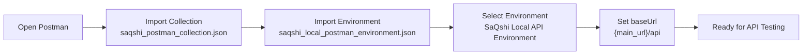

### Authentication Flow

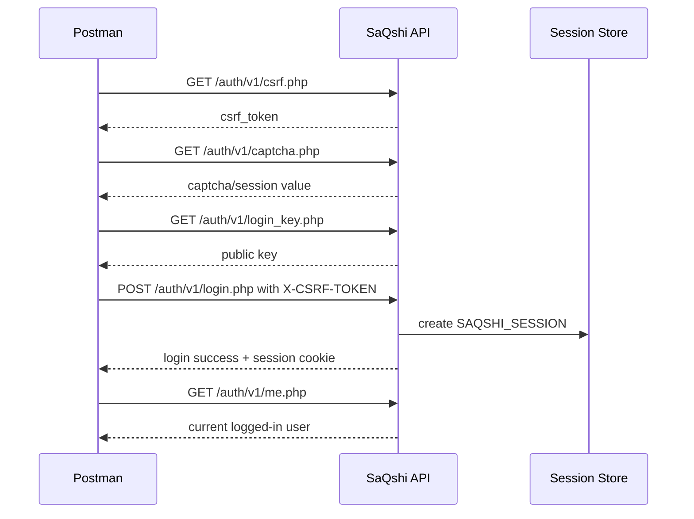

### Assessment and Checklist Flow

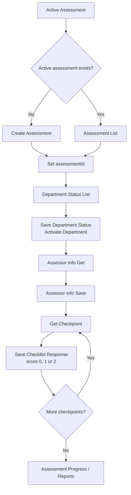

### CQI Flow

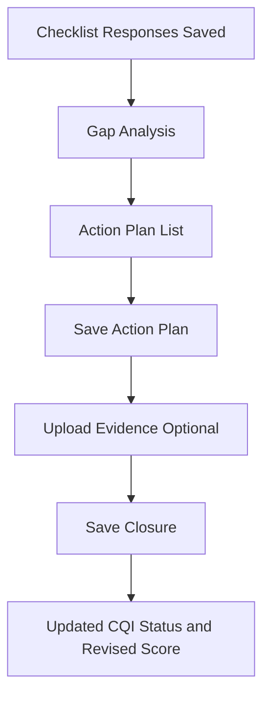

### Performance Flow

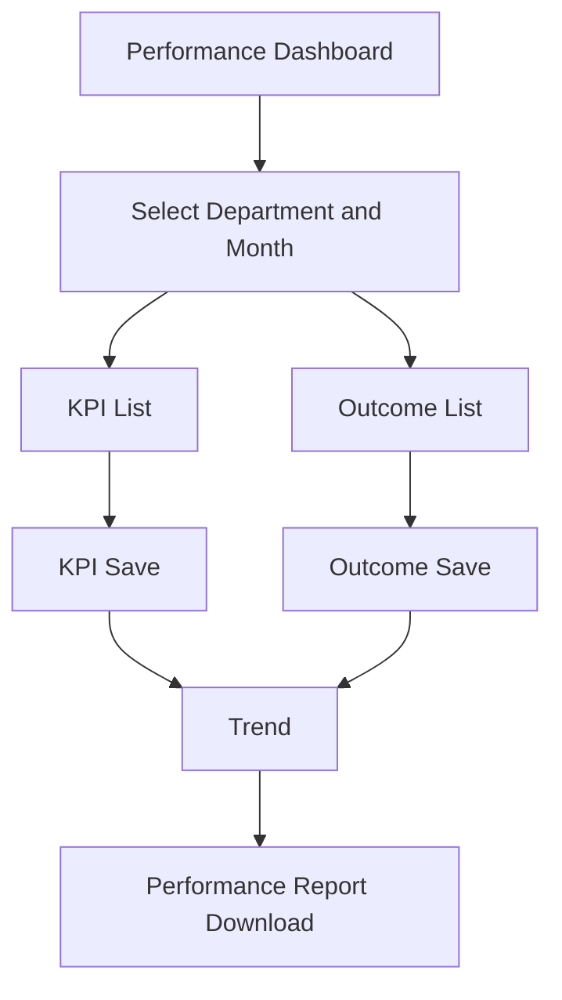

### State Monitoring Flow

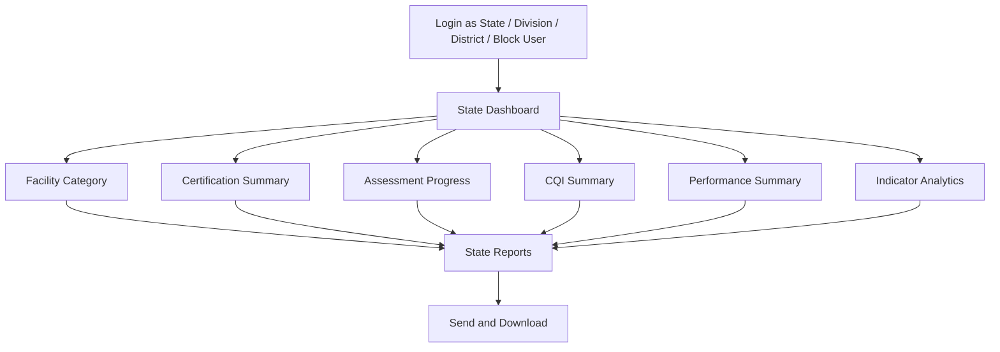

### File Upload and Report Download Flow

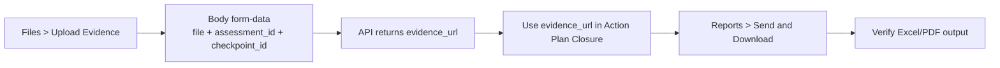

## 4. CSRF Token Setup

Open:

```text
Auth > Get CSRF Token
```

Click **Send**.

Copy the token from the response. The response may look like:

```json
{
  "status": "success",
  "data": {
    "csrf_token": "your-token-here"
  }
}
```

Paste the token into collection variable:

```text
csrfToken
```

For all save/update APIs, Postman sends this header:

```text
X-CSRF-TOKEN: {{csrfToken}}
```

## 5. Captcha Setup

Open:

```text
Auth > Get Captcha
```

Click **Send**.

Use the returned captcha value in the login request body.

If captcha image/session changes, call captcha again and update the login payload.

## 6. Login Testing

Open:

```text
Auth > Login
```

The login API expects encrypted password transport:

```json
{
  "username": "your-user",
  "password_enc": "encrypted-password-value",
  "captcha": "captcha-value"
}
```

Important:

- The browser login page automatically creates `password_enc`.
- In Postman, do not send plain password as `password`.
- For manual Postman testing, generate `password_enc` using the public key from:

```text
Auth > Get Login Public Key
```

If encrypted password generation is not configured in Postman yet, test login first from the browser, then use Postman for authenticated APIs while the same local session/cookie is available only if your browser and Postman share cookies. Normally they do not share cookies, so proper Postman login needs `password_enc`.

## 7. Session Cookie

After successful login, Postman should store the session cookie automatically:

```text
SAQSHI_SESSION
```

Check this in Postman:

1. Click **Cookies** near the request URL.
2. Select the host used in `{main_url}`.
3. Confirm `SAQSHI_SESSION` exists.

If authenticated APIs return unauthorized:

- Login again.
- Confirm cookie exists.
- Confirm `baseUrl` is the same host and port used during login.

Use:

```text
Auth > Current User
```

to verify the session.

## 8. Sample Assessment Flow

Use this order for facility assessment testing:

1. **Assessment > Active Assessment**
2. **Assessment > Assessment List**
3. **Assessment > Create Assessment** if no active assessment exists.
4. Set `assessmentId` from the response.
5. **Assessment > Department Status List**
6. **Assessment > Save Department Status**
7. **Assessment > Assessor Info Get**
8. **Assessment > Assessor Info Save**
9. **Assessment > Get Checkpoint**
10. **Assessment > Save Checklist Response**
11. **Assessment > Assessment Progress**

Visual order:

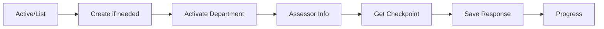

Example checklist response payload:

```json
{
  "assessment_id": 1,
  "dept_id": 25,
  "checkpoint_id": 1001,
  "response_value": "2",
  "score": 2,
  "remarks": "Compliant"
}
```

Score meaning:

| Value | Meaning |
|---|---|
| `0` | Non-compliance |
| `1` | Partial compliance |
| `2` | Full compliance |

## 9. Sample CQI Flow

After checklist responses are saved:

1. **CQI > Gap Analysis**
2. **CQI > Action Plan List**
3. **CQI > Save Action Plan**
4. **CQI > Save Closure**

Visual order:

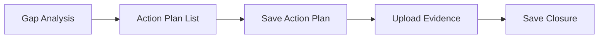

Example action-plan payload:

```json
{
  "assessment_id": 1,
  "checkpoint_id": 1001,
  "action_plan": "Ensure required service availability and document evidence.",
  "responsible_person": "Facility Incharge",
  "target_date": "2026-08-31",
  "remarks": "Planned"
}
```

## 10. Sample Performance Flow

Use this order:

1. **Performance > Dashboard**
2. **Performance > KPI List**
3. **Performance > KPI Save**
4. **Performance > Outcome List**
5. **Performance > Outcome Save**
6. **Performance > Trend**

Visual order:

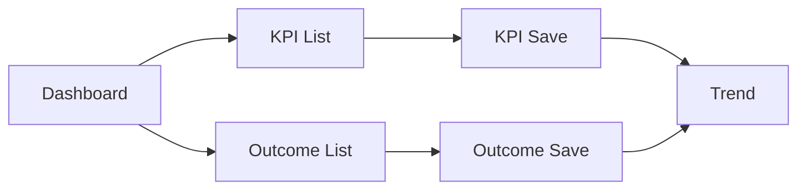

Example KPI/Outcome save payload:

```json
{
  "indicator_id": "KPI_001",
  "department_id": 25,
  "entry_month": 7,
  "entry_year": 2026,
  "numerator": 10,
  "denominator": 20,
  "result": 50,
  "remarks": "Monthly entry"
}
```

If denominator is `N/A` in the UI/config, denominator should be treated as not applicable.

## 11. Sample Monitoring Flow

For state, regional, district and block users:

1. Login with a monitoring role user.
2. Run **Monitoring > Dashboard**.
3. Run related monitoring APIs:
   - Facility Category
   - Certification Summary
   - Assessment Progress
   - CQI Summary
   - Performance Summary
   - Indicator Analytics
   - Reports

Role-based scope is automatic:

| Role ID | Scope |
|---|---|
| `9` | State |
| `5` | Regional/Division |
| `4` | District |
| `8` | Block |

Do not manually pass broad state/district filters to bypass scope. The backend applies scope from the logged-in user.

Visual role scope:

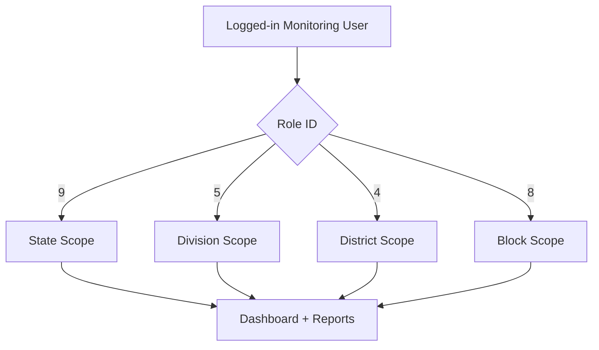

## 12. Testing File Upload

Open:

```text
Files > Upload Evidence
```

Use **Body > form-data**:

| Key | Type | Example |
|---|---|---|
| `file` | File | PDF/Image/Word/Excel |
| `assessment_id` | Text | `1` |
| `checkpoint_id` | Text | `1001` |

After upload, save the returned evidence URL in action plan or closure APIs as required.

To remove wrong upload:

```text
Files > Delete Evidence
```

## 13. Testing Downloads

Report endpoints may return Excel or file download response instead of JSON.

In Postman:

1. Open the report request.
2. Click the arrow beside **Send**.
3. Choose **Send and Download**.
4. Save the downloaded file.
5. Open it in Excel and verify data/format.

## 14. Swagger UI Testing Notes

Open Swagger from the same host/port as the application:

```text
{main_url}/docs/api/swagger-ui.html
```

or through GitBook:

```text
{main_url}/gitbook.html?doc=docs/api/swagger-ui.html
```

The OpenAPI server uses same-origin `/api`, so it follows whatever host and port
you used to open SaQshi. This avoids cross-origin errors such as:

```text
TypeError: NetworkError when attempting to fetch resource
```

If you still see this error:

- Confirm `docs/api/openapi.yaml` opens in the browser.
- Confirm the API URL opens, for example `/api/auth/v1/csrf.php`.
- Open Swagger from the same `{main_url}` where the application is running.
- Login first if the endpoint needs session authentication.
- For state-changing APIs, get CSRF token and add `X-CSRF-TOKEN`.

## 15. Common Errors

| Error | Meaning | Fix |
|---|---|---|
| `401 Unauthorized` | Session missing/expired | Login again and confirm `SAQSHI_SESSION` cookie |
| `403 CSRF token missing/invalid` | `X-CSRF-TOKEN` missing or old | Run CSRF API and update `csrfToken` |
| `Validation failed` | Required payload field missing | Check request body and query parameters |
| `Captcha invalid` | Captcha value expired/wrong | Call captcha API again and update login payload |
| `Something went wrong` | Server handled internal error safely | Check API logs/events for developer details |
| `404 Not Found` | Wrong API URL/path | Confirm `baseUrl` and endpoint path |
| `500 Internal Server Error` | Backend exception | Check PHP error log and SaQshi event log |
| Swagger `NetworkError` | Wrong host/port, API unavailable, YAML unavailable or CORS/session mismatch | Open Swagger from same host/port and confirm `/api/auth/v1/csrf.php` works |

## 16. Recommended Regression Checklist

Before release, test at least:

- Login with facility user.
- Login with state/regional/district/block user.
- Create active assessment.
- Activate department.
- Save assessor information.
- Save checklist response `0`, `1` and `2`.
- Generate gap analysis.
- Save action plan.
- Close gap with revised score.
- Upload and delete evidence file.
- Save KPI and outcome entry.
- Download scorecard and progress report.
- Open monitoring dashboard and verify scoped counts.
- Download state reports.

## 17. Where to See More Details

| File | Purpose |
|---|---|
| `docs/api/README.md` | API testing asset overview |
| `docs/api/openapi.yaml` | Swagger/OpenAPI definition |
| `docs/api/swagger-ui.html` | Local Swagger UI viewer |
| `docs/testing/saqshi_test_plan.md` | Full test plan |
| `docs/testing/saqshi_vapt_report.md` | Security/VAPT notes |
