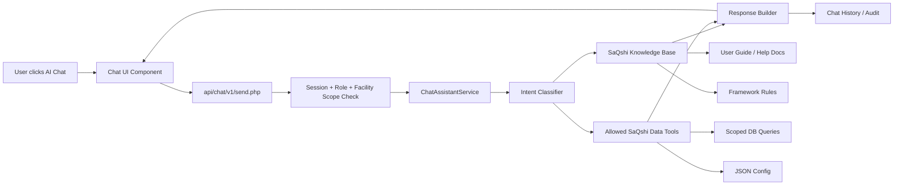
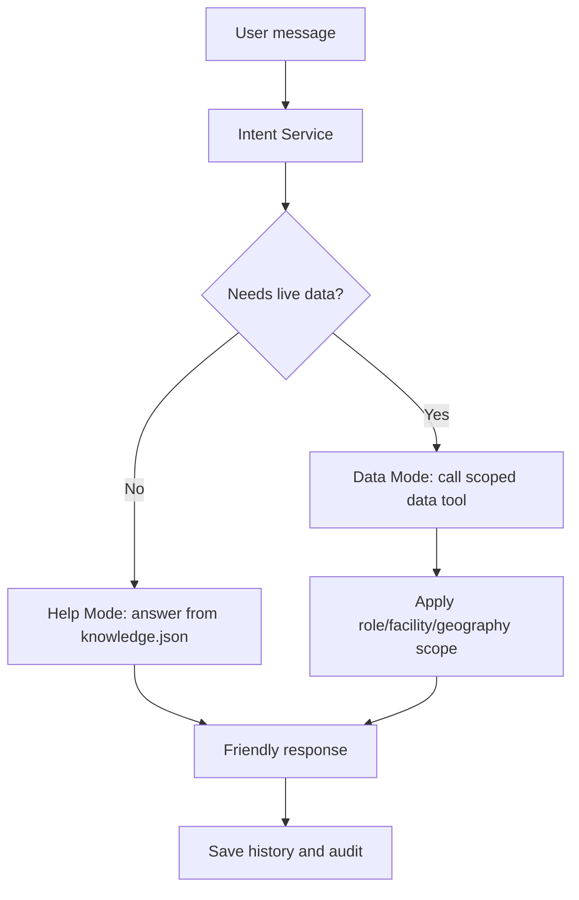
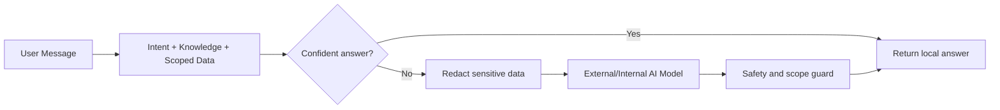

# AI Chat Assistant Architecture

The AI Chat Assistant is a role-aware SaQshi workflow assistant. The first implementation is deterministic and configuration-driven: it answers from intent JSON, knowledge JSON and approved scoped SaQshi data tools. External AI/LLM integration can be added later behind the same service boundary without changing the user interface.

## Current Implementation Status

| Area | Status |
| --- | --- |
| Floating chat UI | Implemented in `ui/components/chat-assistant/`. |
| Chat API | Implemented in `api/chat/v1/send.php`, `history.php` and `clear.php`. |
| Intent matching | Implemented through `api/service/ChatIntentService.php` and `api/config/chat/intents.json`. |
| Knowledge answers | Implemented through `api/service/ChatKnowledgeService.php` and `api/config/chat/knowledge.json`. |
| Scoped live data answers | Implemented through `api/service/ChatDataService.php`. |
| Chat history/audit | Implemented through `ai_chat_messages` table auto-created by `ChatAssistantService`. |
| Friendly errors | Implemented in chat API wrapper; raw PHP/DB errors are logged and hidden from users. |
| External LLM | Not enabled in this release; kept as future extension. |

## Core Architecture



## Main Components

| Component | Purpose |
| --- | --- |
| Chat UI Component | Floating assistant panel, message list, quick suggestions and Read/Stop friendly responses. |
| `api/chat/v1/send.php` | Receives user message, validates session and calls the assistant service. |
| `ChatAssistantService` | Main orchestrator that connects intent matching, knowledge answers, live data tools and response formatting. |
| `ChatIntentService` | Matches user questions against configured intent keywords and role rules. |
| `ChatKnowledgeService` | Loads answer text from configured knowledge JSON files. |
| `ChatDataService` | Provides role-scoped live summaries such as active assessment, pending gaps and current month status. |
| Chat History / Audit | Stores message, answer, intent, user, role, scope and timestamp for traceability. |

## Implemented File Map

```text
api/
+-- chat/v1/
|   +-- send.php       # sends a user question and returns assistant reply
|   +-- history.php    # loads previous chat messages for the logged-in user/facility
|   +-- clear.php      # clears chat history for the logged-in user/facility
|   +-- _common.php    # shared auth, DB and friendly error handling
+-- config/chat/
|   +-- intents.json   # intent keywords, role access and data tool mapping
|   +-- knowledge.json # deterministic help answers
|   +-- prompts.json   # prompt/response style notes for future AI integration
|   +-- safety.json    # safety rules for chat behavior
+-- service/
    +-- ChatAssistantService.php # chat orchestration and history storage
    +-- ChatIntentService.php    # role-aware intent classifier
    +-- ChatKnowledgeService.php # JSON knowledge answer formatter
    +-- ChatDataService.php      # scoped data summaries

ui/
+-- components/chat-assistant/
    +-- chat-assistant.html
    +-- chat-assistant.css
    +-- chat-assistant.js
    +-- chat-assistant.json
```

## Configuration Files

Recommended structure:

```text
api/config/chat/
+-- intents.json
+-- knowledge.json
+-- prompts.json
+-- safety.json
```

`intents.json` defines what the user is asking.

```json
{
  "intents": [
    {
      "intent": "current_month_status",
      "title": "Current Month Status",
      "keywords": [
        "current month",
        "this month",
        "monthly status",
        "assessment completed this month",
        "kpi filled",
        "outcome filled"
      ],
      "roles": ["state", "division", "district", "block"],
      "answer_key": "current_month_status",
      "data_tool": "current_month_status"
    }
  ]
}
```

`knowledge.json` defines the user-facing answer for help questions.

```json
{
  "answers": {
    "start_assessment": {
      "short": "To start an assessment, open Assessment List or Create Assessment.",
      "steps": [
        "If no active assessment exists, create a new assessment.",
        "Activate applicable departments.",
        "Fill assessor information.",
        "Open Checklist and start checkpoint entry.",
        "If you are an external assessor, first open Assigned Facilities and select the mapped facility."
      ]
    }
  }
}
```

## Help Mode and Data Mode



Help Mode answers questions such as:

- How to start an assessment?
- What does 0, 1, 2 mean in checklist?
- How to use screen reader mode?
- Why is checklist not loading?

If the assistant cannot match the question to any configured intent, it returns
the `fallback` answer from `api/config/chat/knowledge.json`. The unmatched
message is still saved in `ai_chat_messages` with `intent_key = fallback`.
Maintainers can review these fallback messages later and add new entries in:

```text
api/config/chat/intents.json
api/config/chat/knowledge.json
```

Example review query:

```sql
SELECT message_text, context_page, created_on
FROM ai_chat_messages
WHERE role = 'user'
  AND intent_key = 'fallback'
ORDER BY created_on DESC;
```

This gives a simple improvement cycle: see what users are asking, add a new
intent keyword set, add the answer text, and redeploy the JSON/config change.

Data Mode answers scoped operational questions such as:

- Show report for Kashipur.
- Current month status.
- KPI filled status.
- Outcome filled status.
- How many facilities have not started action plan?
- How many facilities have pending gap closure?

## Role Scope Rules

The assistant must never bypass SaQshi role scope.

| User Type | Data Scope |
| --- | --- |
| Facility user | Own facility only. |
| External assessor | Facilities mapped to the logged-in assessor only. |
| Block user | Assigned block only. |
| District user | Assigned district only. |
| Division / regional user | Assigned division only. |
| State user | Configured state scope. |

The data tools should reuse the same scope logic used by monitoring dashboards and reports.

## State Monitoring Assistant Intents

### Facility Report Lookup

Used when a monitoring user asks for one facility report by name or NIN.

```json
{
  "intent": "facility_report_lookup",
  "title": "Facility Report Lookup",
  "keywords": [
    "facility report",
    "show facility",
    "facility status",
    "report of",
    "details of",
    "nin"
  ],
  "roles": ["state", "division", "district", "block"],
  "answer_key": "facility_report_lookup",
  "data_tool": "facility_report"
}
```

Expected answer format:

```text
Kashipur facility summary:

Assessment:
- Latest assessment: test
- Status: In Progress
- Score: 42%
- Departments activated: 3
- Checkpoints completed: 40 / 100

CQI:
- Open gaps: 12
- Action plans completed: 6
- Pending action plans: 6
- Gap closures completed: 2

Performance:
- KPI months filled: Jan-26, Feb-26
- Outcome months filled: Jan-26

Certification:
- State certification: Conditional
- Expiry: 2027-07-02
```

### Current Month Status

Used when a monitoring user asks this month status.

```json
{
  "intent": "current_month_status",
  "title": "Current Month Status",
  "keywords": [
    "current month",
    "this month",
    "monthly status",
    "assessment started",
    "assessment completed",
    "assessment in progress",
    "kpi filled",
    "outcome filled"
  ],
  "roles": ["state", "division", "district", "block"],
  "answer_key": "current_month_status",
  "data_tool": "current_month_status"
}
```

Expected answer format:

```text
Current month status for your scope:

- Assessment started: 18 facilities
- Assessment in progress: 10 facilities
- Assessment completed: 8 facilities
- KPI filled: 12 facilities
- Outcome filled: 15 facilities
- Action plan not started: 7 facilities
- Gap closure pending: 9 facilities
```

### Pending CQI Status

Used when a monitoring user asks about action plan or gap closure pending.

```json
{
  "intent": "pending_cqi_status",
  "title": "Pending CQI Status",
  "keywords": [
    "action plan pending",
    "gap closure pending",
    "not started action plan",
    "open gaps",
    "overdue action plan",
    "facility not started action plan"
  ],
  "roles": ["state", "division", "district", "block"],
  "answer_key": "pending_cqi_status",
  "data_tool": "pending_cqi_status"
}
```

Expected answer format:

```text
7 facilities have gaps but action plan is not started in your assigned scope.
Open CQI Monitoring to see facility-wise details.
```

## Implemented Data Tools

`ChatDataService` exposes small, safe methods through one public dispatcher:

```php
ChatDataService::answer($con, $intent, $message, $userId, $facId);
```

Current data tools:

| Tool | What it answers | Scope behavior |
| --- | --- | --- |
| `facility_report` | Facility summary by name/NIN or current facility context. | Facility users see own facility; assessors see assigned facilities; monitoring roles use their geographic scope. |
| `current_month_status` | Assessment started/in progress/completed, KPI filled, Outcome filled and CQI pending counts for current month. | State/division/district/block users only. |
| `pending_cqi_status` | Facilities/action plans completed, pending and overdue. | State/division/district/block users only. |

Each tool must:

- Validate active session.
- Apply role scope before querying data.
- Return summary-level data by default.
- Avoid exposing raw database errors.
- Avoid returning records outside the user scope.
- Limit large result sets and point users to report downloads for full lists.

## Safety Rules

- Do not expose passwords, secrets, raw SQL, server paths or internal PHP warnings.
- Do not show another facility, district or block outside the logged-in user scope.
- For facility search, use name/NIN matching only after applying role scope.
- For large monitoring results, return counts and top summaries first.
- Keep chat answers action-oriented and short.
- Store enough history for audit, but do not store sensitive secrets in chat logs.

## Future AI / LLM Integration

The current version is deterministic and JSON-driven. Later, an LLM can be added behind the same `ChatAssistantService` boundary:



This keeps SaQshi useful now and ready for future AI without redesigning the chat UI or API.
