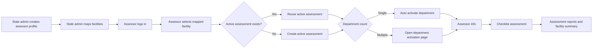
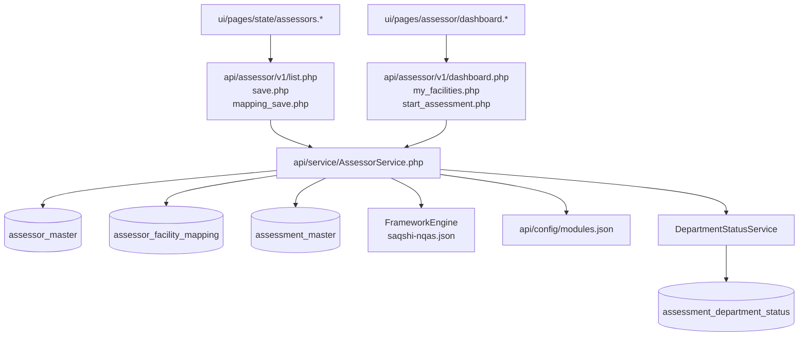

# Assessor Assignment Workflow

Version: 1.0  
Updated: 2026-07-18  
License: GPL-3.0

## Purpose

This workflow supports state-led external assessment where a state administrator maps one
external assessor to multiple facilities. The assessor logs in, selects an assigned
facility and then uses the existing assessment flow.

## Actors

| Actor | Responsibility |
| --- | --- |
| State admin | Creates assessor profile, auto-creates or links login user, maps facilities and monitors progress. |
| External Assessor | Logs in, selects an assigned facility and performs assessment. |
| Facility user | Continues to use the existing facility assessment flow where applicable. |

## High-Level Flow



## Smart Continue Rule

The assessor dashboard does not force the assessor through the same setup
screens again and again. For every mapped facility, the backend returns a
`next_action` object.

| Facility State | Dashboard Action |
| --- | --- |
| No active assessment | `Start Assessment` creates the assessment and selects the facility. |
| Active assessment, no active department | `Activate Department` opens department activation. |
| Department active, assessor info missing | `Assessor Info` opens assessor info for the first active department. |
| Department active, assessor info saved | `Start Checklist` or `Continue Checklist` opens checklist entry directly. |

The UI follows the API decision and passes `assessment_id` and `dept_id` when
needed. This prevents repeated navigation through already completed setup
steps.

## Runtime Design



## Database Changes

Migration file:

```text
api/sql/schema/2026_07_18_assessor_assignment.sql
```

Tables:

| Table | Purpose |
| --- | --- |
| `assessor_master` | Assessor profile, linked login user ID, encrypted name/mobile/email and active status. |
| `assessor_facility_mapping` | Facility assignments for each assessor, assignment status and last assessment reference. |

Assessment table extension:

| Column | Purpose |
| --- | --- |
| `assessment_master.assigned_assessor_id` | Links state-created assessment to the assessor profile. |
| `assessment_master.assessment_source` | Marks assessments created through `STATE_ASSESSOR` flow. |

## API Endpoints

| Endpoint | Method | Purpose |
| --- | --- | --- |
| `/api/assessor/v1/list.php` | GET | List/search assessor profiles for state administration. |
| `/api/assessor/v1/save.php` | POST/PATCH | Create or update assessor profile. |
| `/api/assessor/v1/facility_search.php` | GET | Search facilities for mapping. |
| `/api/assessor/v1/mapping_list.php` | GET | List facilities mapped to an assessor. |
| `/api/assessor/v1/mapping_save.php` | POST/PATCH | Assign or update a facility mapping. |
| `/api/assessor/v1/dashboard.php` | GET | Load logged-in assessor dashboard. |
| `/api/assessor/v1/facility_summary.php` | GET | Load facility history/summary for a mapped facility. |
| `/api/assessor/v1/my_facilities.php` | GET | Load facilities assigned to logged-in assessor. |
| `/api/assessor/v1/start_assessment.php` | POST | Select facility, create/reuse active assessment and route to next step. |

## UI Pages

| Page | Purpose |
| --- | --- |
| `ui/pages/state/assessors.*` | State admin assessor profile and facility mapping. |
| `ui/pages/assessor/dashboard.*` | Assessor landing page and assigned facility list. |
| `ui/pages/assessor/facilities.*` | Assigned facility view for direct navigation. |

## Facility Summary for Assessor

From the assessor dashboard, the assessor can open a mapped facility summary.
The API validates that the facility is mapped to the logged-in assessor before
returning data.

The summary can include:

- assessment history for that facility,
- latest status and score,
- active department count,
- response/checkpoint count,
- KPI/outcome month counts when performance modules are enabled.

Opening the summary also sets the selected mapped facility in session after
mapping validation:

```text
$_SESSION['fac_id']
$_SESSION['assessor_id']
$_SESSION['assessor_selected_fac_id']
```

This allows the assessor to open facility-scoped pages such as:

| Button | Route | Module Dependency |
| --- | --- | --- |
| `Performance Dashboard` | `performance/dashboard` | `performance.enabled = true` |
| `Outcome Trend` | `performance/trend?indicator_type=OUTCOME` | `performance.enabled` and `outcome.enabled` |
| `KPI Trend` | `performance/trend?indicator_type=KPI` | `performance.enabled` and `kpi.enabled` |

Assessor performance access is read-only. The assessor can view KPI/outcome
data already filled by the facility user for that mapped facility, but cannot
create or update KPI/outcome records. The save endpoints also enforce this
server-side:

```text
api/performance/v1/kpi_save.php
api/performance/v1/outcome_save.php
```

CQI gap closure and action plan update remain facility/CQI-user workflows, not
assessor workflows.

## Assessment Result Visibility

Assessor checklist responses are saved in the same assessment response tables
used by the normal facility assessment flow. Because of this, assessor-created
or assessor-updated assessment results automatically reflect in:

- facility dashboard,
- assessment list and reports,
- score/progress reports,
- state monitoring dashboard,
- division, district and block views where the facility falls in that scope.

For large deployments, only summary counts and recent assessment history are
returned by default. Full state-level analytics should remain in state,
district, division and block monitoring pages.

## Configurable Modules

Optional modules are controlled here:

```text
api/config/modules.json
```

Healthcare deployments normally enable assessment, CQI, performance, KPI,
outcome, certification and reports. Deployment owners may disable modules only
when they are outside the approved healthcare implementation scope:

```json
{
  "domain": "healthcare",
  "modules": {
    "assessment": { "enabled": true },
    "cqi": { "enabled": true },
    "performance": { "enabled": true },
    "kpi": { "enabled": true },
    "outcome": { "enabled": true },
    "certification": { "enabled": true },
    "reports": { "enabled": true }
  }
}
```

When a module is disabled, assessor summary cards and action links for that
module are hidden or skipped.

## Session Rule

When an assessor selects a facility, the API validates that the facility is
assigned to the assessor. Only after validation does it set the selected
facility in the session:

```text
$_SESSION['fac_id']
$_SESSION['assessor_id']
$_SESSION['assessor_selected_fac_id']
```

This allows existing pages such as department activation, assessor info,
checklist entry and assessment reports to continue using the same
facility-scoped APIs. CQI action plan and gap closure remain facility/admin
workflows; the assessor view is read-only where summary information is shown.

## Role Rule

Assessor UI is enabled when either:

```text
role_id = 10
```

or the logged-in role name contains:

```text
assessor
```

Deployments can keep their own role IDs by using a role name such as
`Assessor`.

## Security and Privacy

- Assessor name, mobile and email are encrypted at rest through `Crypto.php`.
- New assessor creation can auto-create a login user with username equal to
  assessor code.
- Assessor login is validated through `s_user.u_name`; the assessor name, email
  or mobile number is not accepted as a login identifier unless it is explicitly
  stored as `u_name`.
- Auto-created login users receive a generated temporary password. Only the
  password hash is stored in `s_user`.
- Auto-created login users are marked `password_must_change = 1` and must
  change password on first login.
- Temporary password delivery uses reusable email/SMS service hooks and is not
  returned to the browser.
- Facility selection is allowed only for active mappings.
- Existing session, CSRF and friendly error handling are reused.
- The event layer records assessor save, facility mapping and assessment start
  events without storing passwords or tokens.

## Notification Services

| Service | Config | Purpose |
| --- | --- | --- |
| `api/service/EmailService.php` | `api/config/notifications/email.json` | Email abstraction for temporary password delivery and future alerts. |
| `api/service/SmsService.php` | `api/config/notifications/sms.json` | SMS abstraction for temporary password delivery and future alerts. |

Detailed gateway setup is documented in
[SMS and Email Notification Configuration](../deployment/notification_configuration.md).
