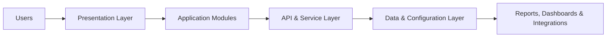
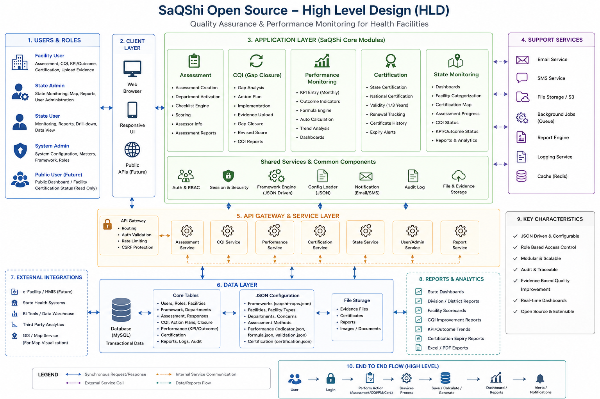
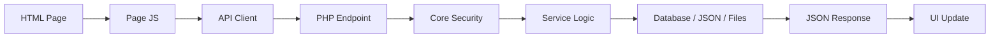
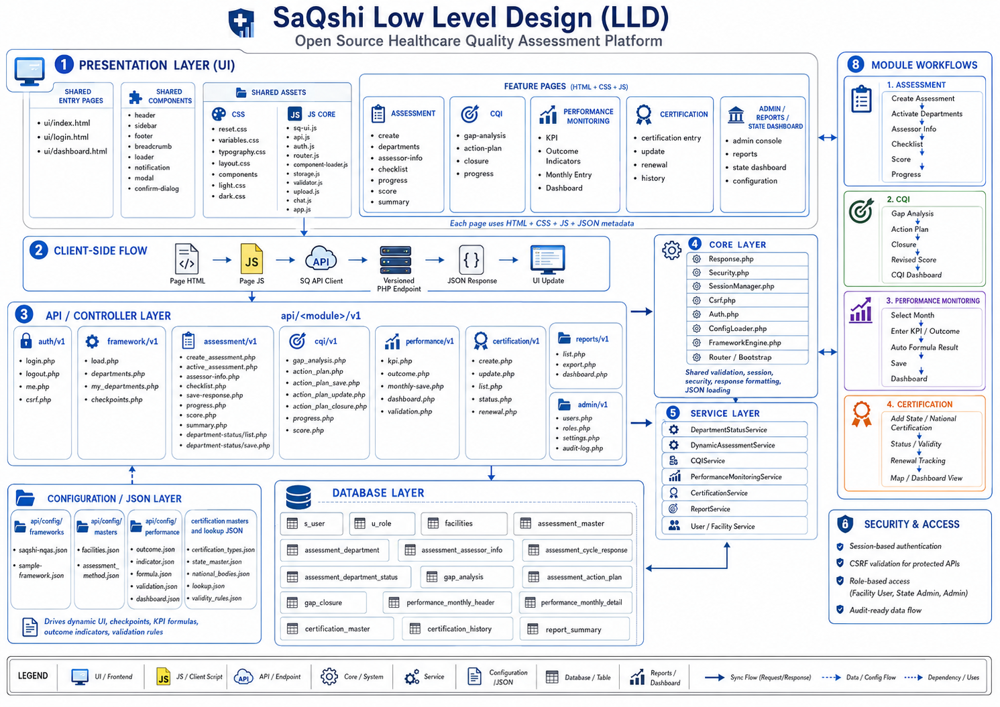

# HLD and LLD Architecture Design

This page keeps the high-level and low-level design simple for presentations and developer onboarding. The official diagrams use a layer-by-layer arrow style so they remain readable on one screen.

## Rectification Notes

| Area | Rectified Documentation Position |
| --- | --- |
| Product name | Use `SaQshi` in general text. Use `SaQshi Open Source` only for license, release, repository or open-source readiness context. |
| Standards reference | Use `NHSRC/NQAS-style formats` where referring to quality programme formats. |
| API gateway | Treat as a logical API entry layer unless a real gateway product is deployed. |
| Support services | Email, SMS, object storage, background jobs and cache are optional integrations, not mandatory core dependencies. |
| Public APIs | Public/external APIs are future-facing unless explicitly enabled. |
| CQI | Describe as Gap Analysis, Action Plan and Gap Closure, not only gap closure. |
| Database table names | Table names in diagrams are indicative and should be checked against actual migrations. |
| Mobile/tablet UI | SaQshi is browser-based responsive UI; native mobile apps are not part of the current release. |

## High Level Design

The HLD should answer one question: how does the whole platform fit together?

| Layer | Includes |
| --- | --- |
| Users | Facility, block, district, division, state, admin and developer users. |
| Presentation Layer | Browser UI, responsive screens, sidebar, router and shared components. |
| Application Modules | Assessment, CQI, performance monitoring, certification, state monitoring and reports. |
| API & Service Layer | Versioned PHP APIs, validation, session, CSRF, business services and event dispatch. |
| Data & Configuration Layer | MySQL/MariaDB, JSON framework files, master data, uploads, logs and events. |
| Reports, Dashboards & Integrations | Downloads, charts, Swagger/Postman docs, maps and optional external services. |

<strong>+ HLD Reference Image</strong>

## Low Level Design

The LLD should answer one question: what happens when a user works on one page?

| Step | What Happens |
| --- | --- |
| HTML Page | Loads the page layout and page-specific containers. |
| Page JS | Reads filters/forms, validates inputs and controls UI state. |
| API Client | Sends request with session and CSRF token where required. |
| PHP Endpoint | Receives the request under `api/<module>/v1`. |
| Core Security | Applies bootstrap, session, role, CSRF and response handling. |
| Service Logic | Applies business rules, calculations and workflow decisions. |
| Database / JSON / Files | Reads or writes transaction data, configuration, evidence and reports. |
| JSON Response | Returns success/error/data in a friendly format. |
| UI Update | Updates cards, tables, forms, progress bars, charts or messages. |

<strong>+ LLD Reference Image</strong>

## Recommended Use

Use these diagrams as architecture communication artifacts:

- HLD is best for project presentations and leadership review.
- LLD is best for developer onboarding and implementation planning.
- For exact file names and endpoints, use the [Service Architecture and Map](service_map.md), [API Source Reference](../api/source-reference.md), and [Endpoint Inventory](../api/endpoint-inventory.md).
