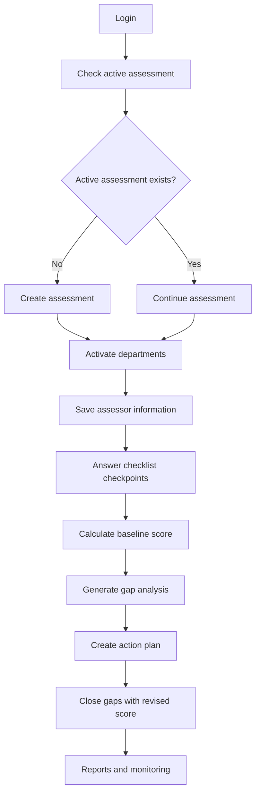

# SaQshi Project Overview and NQAS Alignment

SaQshi is an open-source digital quality assessment and monitoring platform for public health facilities. It is designed to help facility teams, programme managers, and monitoring users move from paper or spreadsheet-based assessment into a structured digital workflow for assessment, CQI, certification, performance monitoring, state monitoring, reporting, and documentation.

This page summarizes the project purpose, the NQAS context, and how the current SaQshi modules fit together.

## NQAS Context

The National Quality Assurance Standards (NQAS), published through NHSRC's Quality and Patient Safety platform, are intended for public health facilities and are used by providers to assess their own quality, improve against predefined standards, and prepare facilities for certification. NHSRC describes NQAS as covering facility types such as District Hospitals, CHCs, PHCs, and Urban PHCs, and as being organized under eight Areas of Concern:

- Service Provision
- Patient Rights
- Inputs
- Support Services
- Clinical Care
- Infection Control
- Quality Management
- Outcome

Reference: [NHSRC National Quality Assurance Standards](https://qps.nhsrcindia.org/national-quality-assurance-standards)

SaQshi does not replace official NQAS policy or certification guidance. It provides an implementation layer that helps facilities and monitoring teams capture, calculate, review, and report the information needed for a quality improvement workflow.

## Why SaQshi Exists

Quality assessment work involves many connected steps: selecting the correct facility framework, activating relevant departments, recording assessor information, answering checkpoints, calculating scores, identifying gaps, preparing action plans, closing gaps, maintaining evidence, and producing reports. When these steps happen in separate files, the quality team loses continuity.

SaQshi keeps the full lifecycle in one application:

1. A facility creates or resumes an assessment.
2. Applicable departments are activated.
3. Assessor and assessee details are captured.
4. Checkpoints are answered one by one with scores 0, 1, or 2.
5. Baseline score and gap analysis are calculated from actual responses.
6. Action plans are created for non-compliant and partially compliant checkpoints.
7. Gap closure captures revised score, remarks, responsible person, target date, and optional evidence.
8. Reports show baseline score, revised score, progress, CQI status, and facility monitoring data.
9. State, district, division, and block users monitor data across their administrative scope.

## Current Functional Scope

| Area | What SaQshi Supports |
| --- | --- |
| Assessment | Assessment creation, active assessment checks, department activation, assessor information, checkpoint entry, baseline scoring, completion and cancellation logic. |
| CQI | Gap analysis, action planning, responsible person, target date, closure remarks, revised score, optional evidence upload and delete. |
| Performance Monitoring | Configurable KPI and Outcome indicators, monthly entry, department-aware indicator loading, formula-based result calculation, trend dashboard and downloads. |
| Certification | State/National certification status, history, validity, expiry tracking, map view, and state-level certification monitoring. |
| State Monitoring | State, division, district, and block dashboards with facility category, certification status, assessment progress, CQI monitoring, performance monitoring, drill-down, users, and reports. |
| Reports | Scorecard, checklist download, progress report, CQI report, performance downloads, state reports, indicator analytics. |
| Documentation | User guide, developer guide, API testing guide, Swagger UI, security review, testing reports, accessibility notes, open-source compliance docs. |

## Assessment and CQI Lifecycle



## NQAS Areas and SaQshi Data Model

SaQshi keeps the framework configurable so that the checklist structure can evolve without rewriting page logic. The current checklist framework is held in JSON and read by the API services.

| NQAS Concept | SaQshi Implementation |
| --- | --- |
| Facility type | Facility master data and framework configuration. |
| Department | Department JSON and activated assessment departments. |
| Area of Concern | Concern-level grouping inside the framework JSON. |
| Standard / Measurable Element | Checklist hierarchy from the configured assessment framework. |
| Checkpoint | One scored response row in the checklist flow. |
| Assessment Method | Optional method/verification metadata from the framework. |
| Score | User-entered compliance score: 0 non-compliance, 1 partial compliance, 2 full compliance. |
| Gap | Any checkpoint with baseline score 0 or 1. |
| Gap Closure | Action plan closure with revised score and optional evidence. |

## Role-Based Monitoring Scope

SaQshi separates facility data entry from monitoring views:

| Role Level | Typical Scope |
| --- | --- |
| Facility user | Create assessment, activate departments, complete checklist, CQI, performance, certification, and facility profile. |
| Block user | Monitor facilities within the block. |
| District user | Monitor facilities within the district. |
| Division / regional user | Monitor facilities within the division or region. |
| State admin | Monitor state-wide data, certification, dashboards, users, exports, and reports. |

## Configuration-Driven Design

The project is intentionally JSON-driven where possible:

- `api/config/frameworks/saqshi-nqas.json` defines checklist and checkpoint structure.
- `api/config/masters/facilities.json` can be used as a master facility source before database updates.
- `api/config/masters/departments.json` provides department names and mappings.
- `api/config/performance/kpi.json`, `outcome.json`, `formula.json`, and `validation.json` drive performance entry.
- `api/config/state/map.json` controls state map boundary and fit behavior.
- `api/config/certification/certification.json` controls certification options and validity rules.

This keeps SaQshi adaptable for future NQAS revisions, other states, or additional quality programmes.

## Event-Ready Architecture

SaQshi includes an event abstraction direction so important workflow moments can be dispatched consistently:

```php
Event::dispatch("assessment.completed", $assessmentData);
Event::dispatch("gap.closed", $closureData);
Event::dispatch("certification.updated", $certificationData);
```

At present, this can log events or call local listeners. Later, the implementation can publish to Kafka or another message broker without changing every API endpoint.

## What the Uploaded Technical Design Adds

The latest technical design document confirms the current implementation direction:

- `assessment_master` is the main assessment unit.
- A new assessment is created only when no active assessment exists, or the previous one is completed/cancelled.
- `assessment_id` is reused as `cycle_id` in `assessment_cycle_response` for compatibility.
- Department activation is tied to assessment, facility, and department.
- Assessor information is department-wise.
- Checklist entry is one checkpoint at a time with next, previous, save, update, and resume behavior.
- CQI uses gap analysis, action plan, gap closure, and revised score rather than a separate reassessment module.
- Performance monitoring is JSON-driven and supports KPI/outcome indicators, formula calculation, and monthly trend reporting.
- Certification history and state monitoring are part of the same monitoring ecosystem.

## Related GitBook Pages

- [Technical Architecture Overview](technical_architecture.md)
- [Configuration JSON Formats](configuration_formats.md)
- [Service Architecture and Map](service_map.md)
- [Complete User Guide](../user/user_guide.md)
- [API Developer Documentation](../api/README.md)
