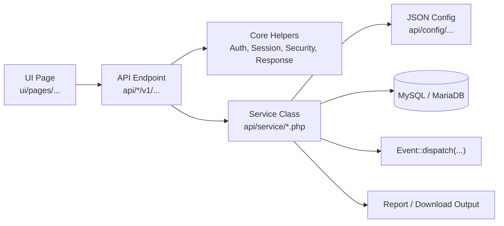

# SaQshi Service Map

Version: 1.0  
Updated: 2026-07-15  
License: GPL-3.0

## Purpose

This document explains the service layer in SaQshi: what each
service does, which API endpoints use it, and which UI pages are connected to
that API flow.

## Service Architecture Diagram


This diagram shows the current SaQshi service model. The application is not a
distributed microservice platform today; it is a modular PHP application where
UI pages call versioned API endpoints, endpoints call shared core helpers and
service classes, and service classes coordinate database records, JSON
configuration, file storage, reports, logs and events.

Service files are located here:

```text
api/service/
```

The service layer keeps business logic out of page JavaScript and endpoint
controller files. UI pages call APIs. APIs validate the request, load session
context, then call services. Services read configuration, query/update the
database, calculate results, dispatch events and return structured data.

## Service Layer Flow



## Service Inventory

| Service | Main Responsibility | API Linked | UI Linked |
|---|---|---|---|
| `AuthService.php` | Login-support operations, current user/session-related helper behavior. | Auth APIs, login/current-user endpoints. | `ui/pages/login`, dashboard shell. |
| `ValidationService.php` | Common validation helpers for required fields and request payloads. | Shared by multiple API endpoints. | All forms that call APIs indirectly rely on it. |
| `DashboardService.php` | Facility dashboard summary helper. | Dashboard APIs. | `ui/pages/dashboard`. |
| `DynamicAssessmentService.php` | Reads framework JSON and manages assessment checklist structure: facility type, departments, concerns, subtypes, checkpoints and response flow. | `api/assessment/v1/*`, checklist/response APIs. | `ui/pages/assessment/checklist.*`, assessment reports. |
| `DepartmentStatusService.php` | Lists and saves activated/deactivated departments for an active assessment. | `api/assessment/v1/department-status/list.php`, `save.php`. | `ui/pages/assessment/departments.*`, sidebar assessment flow. |
| `CertificationService.php` | Certification create/update/list/history workflow and facility certification state. | `api/certification/*`, `api/state/v1/certification*`. | State certification status pages, certification map/status screens. |
| `CertificationValidator.php` | Validates certification payloads such as status, dates, score and certification type. | Certification save/update APIs. | Certification update/add modal/page. |
| `CertificationExpiryService.php` | Calculates certification validity, expiry and renewal status. | Certification APIs and state certification summaries. | Certification status pages and reports. |
| `PerformanceService.php` | Main performance module service: dashboard, trend, monthly entries, status, exports and indicator aggregation. | `api/performance/v1/dashboard.php`, `trend.php`, `summary.php`, related endpoints. | `ui/pages/performance/dashboard.*`, `trend.*`, report dashboard. |
| `KPIService.php` | KPI indicator listing, save/update, history and status. | `api/performance/v1/kpi_list.php`, `kpi_save.php`, `kpi_history.php`. | `ui/pages/performance/kpi.*`. |
| `OutcomeService.php` | Outcome indicator listing, save/update, history and status. | `api/performance/v1/outcome_list.php`, `outcome_save.php`, `outcome_history.php`. | `ui/pages/performance/outcome.*`. |
| `IndicatorService.php` | Shared indicator configuration loading/filtering by facility type, department and indicator rules. | Performance KPI/outcome APIs. | KPI and outcome pages. |
| `FormulaEngine.php` | Calculates indicator result from numerator, denominator and formula configuration. | KPI/outcome save and dashboard/trend APIs. | KPI/outcome entry pages and trend/dashboard charts. |
| `StateDashboardService.php` | Main state-level aggregation service for facility counts, categories, assessment status, CQI, certification, performance and role-based monitoring. | `api/state/v1/dashboard.php`, state monitoring endpoints. | `ui/pages/state/dashboard.*`, state monitoring cards. |
| `StateAssessmentService.php` | Thin state assessment module entry service/wrapper. | State assessment progress API. | `ui/pages/state/assessment-progress.*`. |
| `StateCertificationService.php` | Thin state certification module entry service/wrapper. | State certification status APIs. | `ui/pages/state/certification-status.*`, certification map. |
| `StateCQIService.php` | Thin state CQI module entry service/wrapper. | State CQI monitoring API. | `ui/pages/state/cqi.*`. |
| `StatePerformanceService.php` | Thin state performance module entry service/wrapper. | State performance monitoring API. | `ui/pages/state/performance.*`. |
| `StateFacilityCategoryService.php` | Thin state facility categorization service/wrapper. | Facility categorization API. | `ui/pages/state/facility-categorization.*`. |
| `StateFacilityDrilldownService.php` | Thin drill-down service/wrapper for state -> division -> district -> block -> facility flow. | Facility drill-down API. | `ui/pages/state/facility-drilldown.*`. |
| `StateMapService.php` | Thin map service/wrapper for map/certification geography. | Certification map API. | `ui/pages/state/certification-map.*`. |
| `StateIndicatorAnalyticsService.php` | Finds low-performing checklist indicators, counts facilities scoring zero, and prepares downloadable indicator analytics. | State indicator analytics API. | State indicator analytics/report sections. |
| `StateReportService.php` | Builds state-level downloadable reports for facilities, assessment, CQI, performance and certification. | `api/state/v1/reports.php`. | `ui/pages/state/reports.*`. |
| `StateUserAdminService.php` | State user administration support such as listing/searching and activate/deactivate actions. | State user administration API. | `ui/pages/state/user-administration.*`. |
| `ChatAssistantService.php` | Provides contextual help/chat responses from configured app/document knowledge. | Chat assistant API. | Header/chat widget. |

## Module-by-Module Service Relationships

### Authentication and Session

```text
ui/pages/login
  -> auth API endpoints
    -> AuthService
    -> api/core/Auth.php, SessionManager.php, Csrf.php, LoginCrypto.php
```

Main responsibilities:

- Verify user login.
- Maintain session context.
- Support role-aware navigation.
- Keep sensitive login operations outside page JavaScript.

### Assessment

```text
ui/pages/assessment/create
ui/pages/assessment/departments
ui/pages/assessment/assessor-info
ui/pages/assessment/checklist
  -> api/assessment/v1/*
    -> DynamicAssessmentService
    -> DepartmentStatusService
    -> ValidationService
```

Main responsibilities:

- Create and manage active assessment lifecycle.
- Load framework/checklist JSON.
- Load departments by facility type and active assessment.
- Save department activation state.
- Load area of concern, subtype, method and checkpoint flow.
- Save `0`, `1`, `2` checkpoint response and score.

### CQI

```text
ui/pages/cqi/gap-analysis
ui/pages/cqi/action-plan
ui/pages/cqi/closure
  -> assessment/CQI APIs
    -> DynamicAssessmentService
    -> StateDashboardService for monitoring summaries
```

Main responsibilities:

- Identify gaps from checklist responses.
- Show default action plans from checklist JSON.
- Save user-created action plans.
- Upload and delete evidence.
- Close gaps and update CQI status.

### Performance Monitoring

```text
ui/pages/performance/kpi
ui/pages/performance/outcome
ui/pages/performance/dashboard
ui/pages/performance/trend
  -> api/performance/v1/*
    -> PerformanceService
    -> KPIService
    -> OutcomeService
    -> IndicatorService
    -> FormulaEngine
```

Main responsibilities:

- Load KPI/outcome indicators by facility type and activated department.
- Save monthly numerator, denominator, result and remarks.
- Treat configured outcome-as-KPI rules from JSON where applicable.
- Build month-wise status and trend charts.
- Download KPI/outcome reports.

### Certification

```text
ui/pages/state/certification-status
ui/pages/state/certification-map
  -> certification/state APIs
    -> CertificationService
    -> CertificationValidator
    -> CertificationExpiryService
    -> StateDashboardService
```

Main responsibilities:

- List facility certification status.
- Add/update certification history.
- Validate certification type, mode, date, score and renewal status.
- Calculate validity and expiry.
- Feed certification map and state dashboard cards.

### State, District, Division and Block Monitoring

```text
ui/pages/state/*
  -> api/state/v1/*
    -> StateDashboardService
    -> StateReportService
    -> StateIndicatorAnalyticsService
    -> State* wrapper services
```

Main responsibilities:

- Restrict data by role: state, division, district or block.
- Aggregate facility category, assessment, CQI, performance and certification.
- Support pagination and search for high-volume facility lists.
- Generate state-level downloads.
- Identify low-performing checklist indicators.

### Reports

```text
ui/pages/reports/*
ui/pages/state/reports
  -> report APIs
    -> StateReportService
    -> PerformanceService
    -> DynamicAssessmentService
```

Main responsibilities:

- Generate scorecards and checklist downloads.
- Download CQI details.
- Download performance month summaries.
- Download state reports for facility, assessment, CQI, performance and certification data.

### Chat and Help

```text
ui/components/header
ui/assets/js/core/chat.js
  -> chat API
    -> ChatAssistantService
```

Main responsibilities:

- Provide user-facing help.
- Explain application sections and documentation.
- Keep chat behavior separate from core workflow APIs.

## Wrapper Services

Some `State*Service.php` files are intentionally thin wrappers. They exist so
future state modules can grow independently without changing endpoint names or
UI routing. Current heavy aggregation logic is centralized mostly in
`StateDashboardService.php`, `StateReportService.php` and
`StateIndicatorAnalyticsService.php`.

## Event Use in Services

Services should dispatch domain events after important changes:

```php
Event::dispatch('assessment.completed', $assessmentData);
Event::dispatch('gap.closed', $closureData);
Event::dispatch('certification.updated', $certificationData);
Event::dispatch('performance.entry.saved', $entryData);
```

Today these can be logged locally. Later the `Event` implementation can publish
to Kafka without changing API endpoint or UI page code.

## Service Design Rules

- API files should stay thin: validate request, call service, return response.
- Business logic should live in `api/service`.
- Shared security/session/response behavior should live in `api/core`.
- Services should not echo HTML or raw PHP errors.
- Services should return arrays/objects that APIs convert to JSON.
- Database values should use prepared statements.
- UI pages should not know database table structure directly.
- New service files must be added to this document and to API documentation when public behavior changes.

## Related Documents

- [Technical Architecture Overview](technical_architecture.md)
- [Configuration JSON Formats](configuration_formats.md)
- [API Developer Documentation](../api/README.md)
- [API Source Reference](../api/source-reference.md)
