# SaQshi Technical Architecture

Version: 1.0  
Updated: 2026-07-18  
License: GPL-3.0

## Purpose

This document shows the high-level technical architecture of the current healthcare/NQAS release of SaQshi.
It is intended for developers, implementers, technical reviewers and deployment
teams who need to understand how UI pages, APIs, services, configuration,
database tables, reporting, monitoring and future event integration fit together.

## Documentation Scope

To avoid repeating the same information across GitBook pages:

| Page | Keep Here | Avoid Here |
| --- | --- | --- |
| Technical Architecture Overview | Platform layers, main runtime flow, major module boundaries, infrastructure and release diagrams. | Full endpoint inventories or long service-by-service descriptions. |
| Service Architecture and Map | Service diagram, service inventory, module-to-service relationships and service rules. | Deployment steps or database migration instructions. |
| HLD and LLD | Simple presentation-style diagrams and short explanation for onboarding. | Detailed file lists already covered by technical architecture and service map. |
| Configuration JSON Formats | Facility JSON, checklist/framework JSON, map JSON, KPI/outcome/formula JSON examples. | Runtime sequence diagrams. |
| Deployment Guide | Server setup, `.env`, IIS/Apache/Nginx/cloud, backup and release process. | Business workflow details. |

## System Architecture Diagram

This diagram gives a readable top-level view. It intentionally keeps only the main layers so the diagram remains readable in the browser.

### Presentation-style Platform Diagram

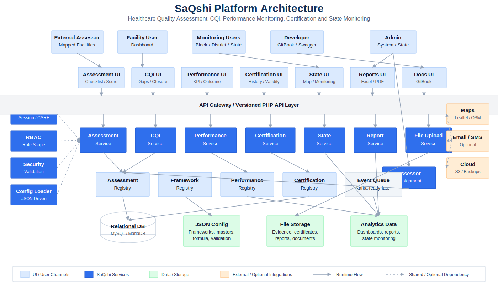

### Layer Diagram

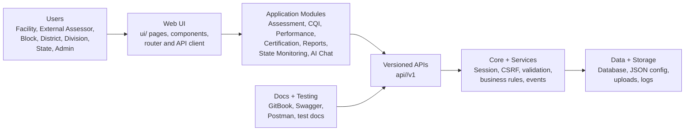

### User and Module View

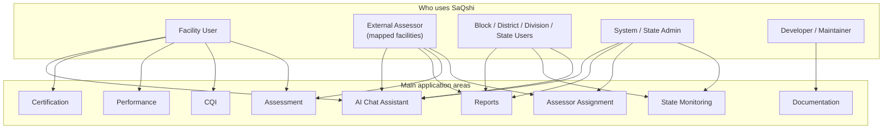

For the detailed role-module matrix and module flow diagrams, see
[User and Module View](user_module_view.md).

### API and Data View

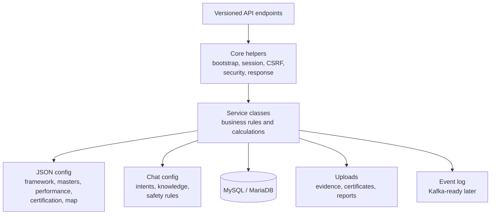

### Service Architecture

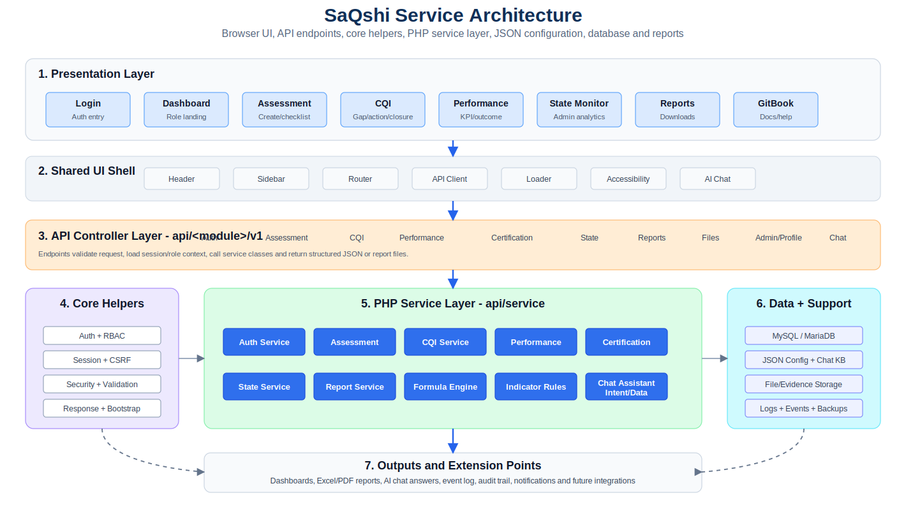

The service architecture shows how UI pages, shared UI components, versioned
API endpoints, core helpers, PHP service classes, database records, JSON
configuration, uploads, reports, logs and events work together.

### Layer Responsibilities

| Layer | What User Should Understand |
| --- | --- |
| Users | Facility users enter data. Monitoring users review progress. Admin users manage broader state-level activities. |
| UI | Browser pages collect input, show dashboards and call APIs. |
| Modules | Assessment, CQI, performance, certification, reports and state monitoring are separate functional areas. |
| API | Versioned PHP endpoints receive requests and return friendly JSON responses. Chat APIs also receive user questions and return scoped assistant answers. |
| Core + Services | Shared validation, session, CSRF, security, business rules, formulas and event dispatching live here. |
| Data + Storage | MySQL stores transactions, JSON config drives dynamic behavior, uploads store evidence/report files. |

## System Architecture File Visualisation

This diagram shows the repository from a developer file/folder point of view. It is intentionally compact so it fits on one screen.

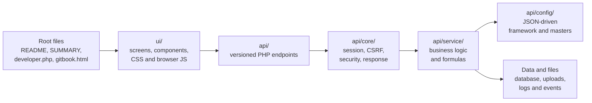

| Folder / Area | Purpose |
| --- | --- |
| Root files | Project entry documentation, developer landing page and GitBook reader. |
| `ui/` | Browser screens, shared components, styles and JavaScript runtime. |
| `api/` | Versioned API endpoints for auth, assessment, CQI, performance, certification, state, chat and files. |
| `api/core/` | Common request handling, session, CSRF, security, response and event helpers. |
| `api/service/` | Business rules, calculations, reporting logic, state monitoring logic and chat orchestration logic. |
| `api/config/` | JSON configuration for framework, master data, performance indicators, certification, maps and planned chat intents/knowledge. |
| Data and files | MySQL/MariaDB tables, uploaded evidence/certificates/reports, logs and event records. |

## Architecture Folder Map

```text
open_source/
+-- developer.php
+-- gitbook.html
+-- README.md
+-- SUMMARY.md
+-- api/
|   +-- bootstrap.php
|   +-- auth/v1/
|   +-- framework/v1/
|   +-- assessment/v1/
|   +-- cqi/v1/
|   +-- performance/v1/
|   +-- certification/v1/
|   +-- state/v1/
|   +-- chat/v1/
|   +-- files/v1/
|   +-- core/
|   +-- service/
|   +-- config/
+-- ui/
|   +-- login.html
|   +-- dashboard.html
|   +-- assets/
|   +-- components/
|   +-- pages/
+-- docs/
|   +-- architecture/
|   +-- api/
|   +-- database/
|   +-- security/
|   +-- testing/
|   +-- compliance/
|   +-- user/
+-- uploads/
+-- tools/
+-- scripts/
```

## Main Runtime Flow

This sequence shows the runtime path for any normal user action, such as saving a checklist response, loading an action plan, saving KPI/outcome data, or opening a state dashboard.

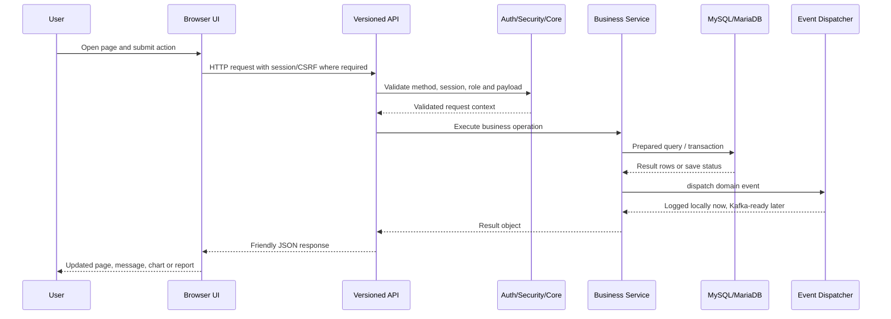

### Runtime Flow in Detail

| Stage | Main Files / Area | What Happens | Output |
| --- | --- | --- | --- |
| 1. Page route | `ui/dashboard.html`, `ui/assets/js/core/router.js` | The browser opens a route or direct page. The router loads the correct HTML, CSS, JS and JSON metadata for the selected module. | Page shell and page script are loaded. |
| 2. Page initialization | `ui/pages/<module>/<page>.js` | Page JS reads URL parameters, session context, default filters and page JSON settings. It prepares empty cards/tables/forms before data arrives. | Page is visible with loading or empty states. |
| 3. API request | `ui/assets/js/core/api.js` | API client sends GET/POST request to a versioned endpoint. For protected actions it includes session cookies and CSRF token where required. | HTTP request reaches PHP API. |
| 4. Bootstrap | `api/bootstrap.php` | Bootstrap loads environment values, database connection, error handling, response helpers, session and common core classes. | API has application context. |
| 5. Security check | `api/core/*`, endpoint validation | API checks request method, login session, role permission, CSRF token, required fields and payload type. | Validated request or friendly error response. |
| 6. Role scope | Session + service filters | Facility users are limited to their facility. Block, district, division and state users get scoped data only for their level. | Safe query/filter context. |
| 7. Service call | `api/service/*.php` | Endpoint delegates business logic to service classes such as assessment, performance, certification, state, reports or chat assistant. | Service result object. |
| 8. Configuration read | `api/config/**/*.json` | Services load framework, department, facility type, validation, performance indicator, formula or map configuration as needed. | Dynamic rules and labels. |
| 9. Data operation | MySQL/MariaDB tables | Services use prepared queries or safe helpers to read/write assessment, CQI, performance, certification, user or state data. | Rows, calculated values or saved records. |
| 10. Files and evidence | `uploads/`, report output | File APIs validate upload type/path. Report APIs generate Excel/PDF/CSV output. Evidence and reports are stored or streamed. | File URL, report download or storage update. |
| 11. Event dispatch | `Event::dispatch(...)` | Important actions are logged as domain events, keeping the code ready for future queue/Kafka style publishing. | Local event/audit entry. |
| 12. Response | `api/core/Response.php` | API returns consistent success/error JSON, or a downloadable file for report endpoints. Raw PHP/database errors should not reach users. | Friendly API response. |
| 13. UI update | Page JS + shared components | Page updates cards, forms, tables, progress bars, charts, alerts or navigation state. | User sees the result. |

### Runtime Variations

#### Normal JSON API Flow

Most pages use this flow:

```text
Page JS -> SQ API client -> api/<module>/v1/<endpoint>.php
        -> bootstrap/security -> service -> database/config
        -> JSON response -> UI update
```

Examples:

- Assessment department activation.
- Assessor information save.
- Checklist checkpoint response save.
- KPI/outcome monthly entry.
- State dashboard card loading.

#### AI Chat Assistant Flow

The chat assistant uses the same security model as other APIs, but the service
first classifies the user question before choosing a help answer or a scoped
data summary.

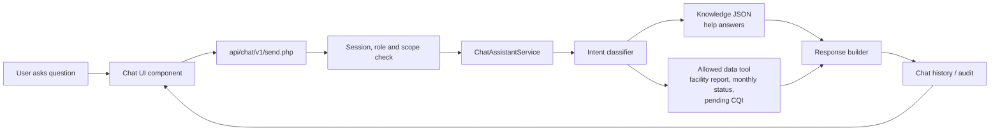

Examples:

- Facility user asks how to start assessment: answer comes from configured help knowledge.
- External assessor asks how to assess mapped facility: answer explains Assigned Facilities and checklist flow.
- State user asks current month status: answer comes from scoped monitoring data.
- District user asks for one facility report: lookup is restricted to that district.

#### Report Download Flow

Report pages are slightly different because the endpoint may return a file
instead of JSON:

```text
Report button -> report API endpoint -> scoped query/calculation
              -> Excel/PDF/CSV generation -> browser download
```

The report endpoint still applies session, role scope and validation before
generating the file.

#### Upload Flow

Evidence upload and certificate/document upload use this flow:

```text
File input -> upload API -> file validation -> safe storage path
           -> database reference -> JSON response with file metadata
```

Upload APIs should validate type, size, extension and generated file name. A
wrong uploaded file can be removed through the delete API where enabled.

#### State Monitoring Flow

State, division, district and block dashboards use the same API style but add a
role scope filter before querying large data:

```text
State page -> state API -> role scope resolver
           -> paginated/searchable service query -> JSON response
```

This keeps large facility lists from loading all at once and allows search,
pagination and drill-down behavior.

### Error Handling Rules

- API endpoints should return friendly messages, not raw SQL/PHP warnings.
- Validation errors should identify the field and expected action.
- Database connection errors should show a general service-unavailable message.
- Page JS should show the page layout even when data loading fails.
- Developer details should be written to logs, not displayed to end users.
- Report/download failures should return a clear message and avoid broken files.

### Security Rules in the Flow

- Credentials and secrets come from `.env`.
- Login/session state is checked before protected data is returned.
- CSRF is required for protected write actions.
- Role scope is applied before state, district, block or facility data is queried.
- SQL access should use prepared statements or safe query builders.
- Uploaded files should never be executed as PHP.

## Main Runtime Flow by Files

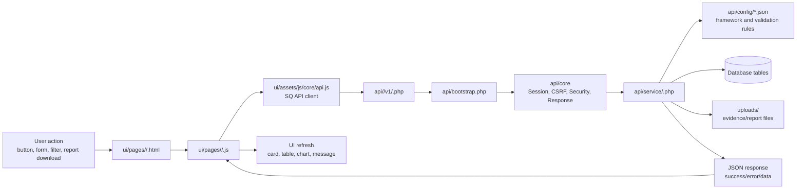

## Example Runtime: Checklist Response Save

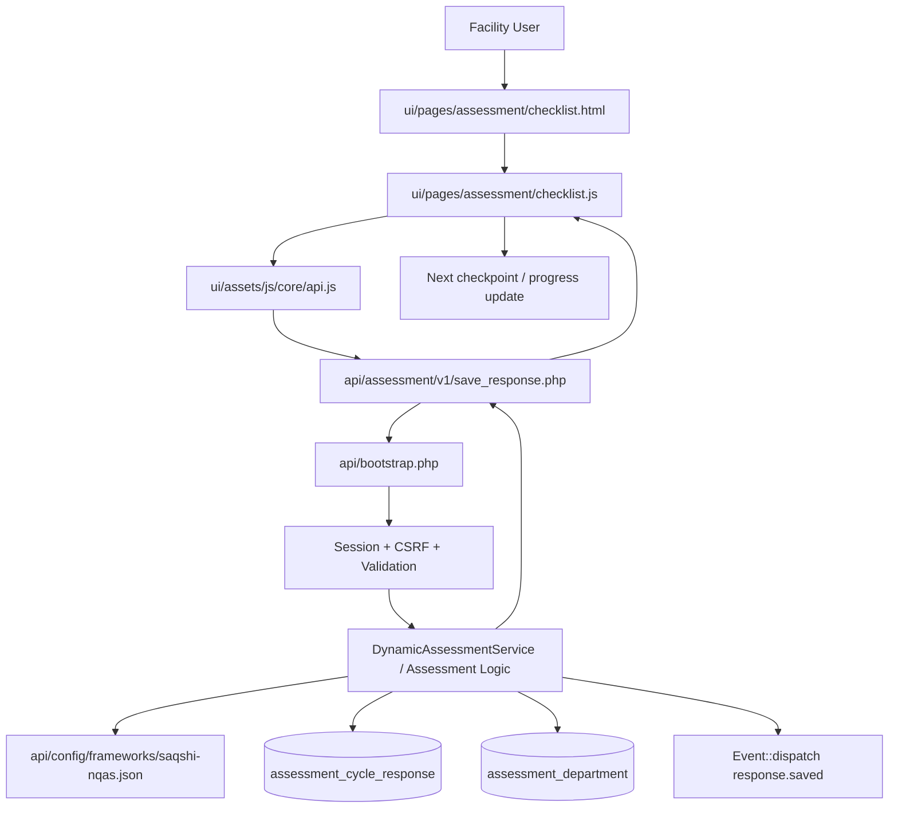

## Example Runtime: State Dashboard Load

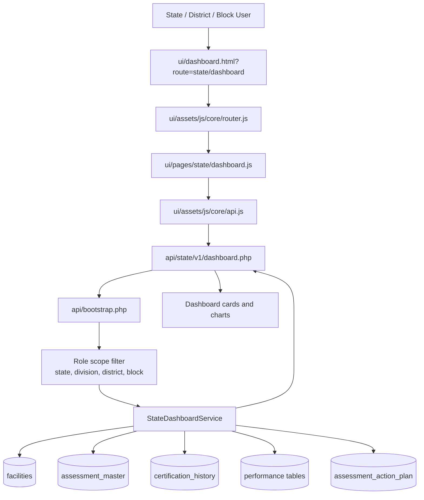

## Major Modules

| Module | UI Area | API Area | Main Responsibility |
|---|---|---|---|
| Authentication | `ui/pages/login` | `api/auth*`, `api/core` | Login, captcha, CSRF, session and role-aware routing. |
| Assessment | `ui/pages/assessment` | `api/assessment/v1` | Assessment creation, active assessment, department activation, assessor details and checklist scoring. |
| CQI | `ui/pages/cqi` | `api/assessment/v1`, CQI endpoints | Gap analysis, action plan, evidence upload and gap closure. |
| Performance | `ui/pages/performance` | `api/performance/v1` | KPI/outcome month-wise entry, trend and dashboard analytics. |
| Reports | `ui/pages/reports` | `api/reports/v1`, `api/state/v1/reports.php` | Scorecards, checklist downloads, state reports and performance exports. |
| State Monitoring | `ui/pages/state` | `api/state/v1` | Role-based state, division, district and block monitoring. |
| AI Chat Assistant | `ui/components/chat-assistant`, header/chat widget | `api/chat/v1` | Role-aware workflow help, error explanation and scoped monitoring summaries. |
| Documentation | `developer.php`, `gitbook.html`, `docs/` | Static markdown/docs | Open-source, developer, API, testing, security and release documentation. |

## Deployment View

### Infrastructure Architecture

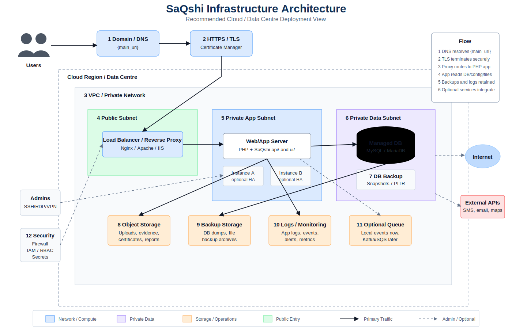

### Release and Deployment Architecture

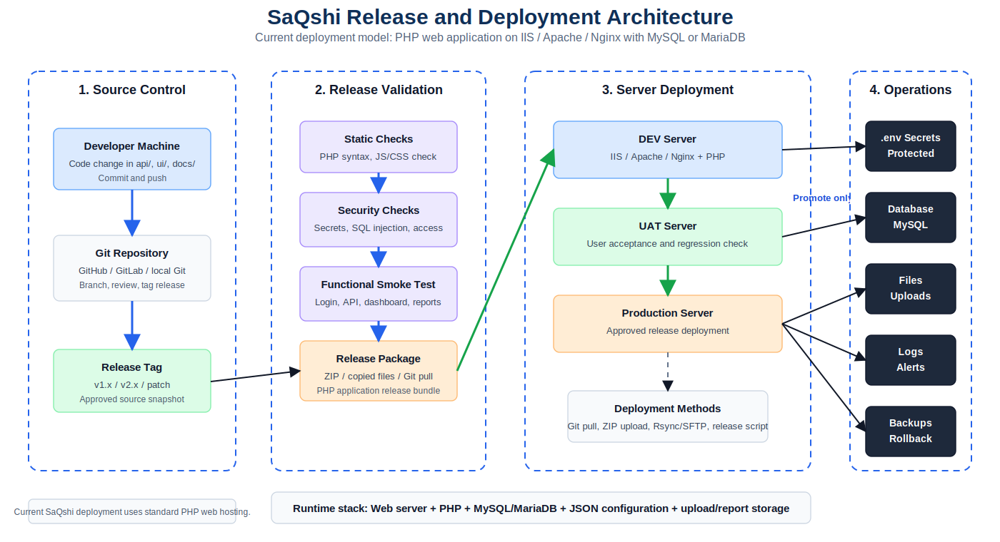

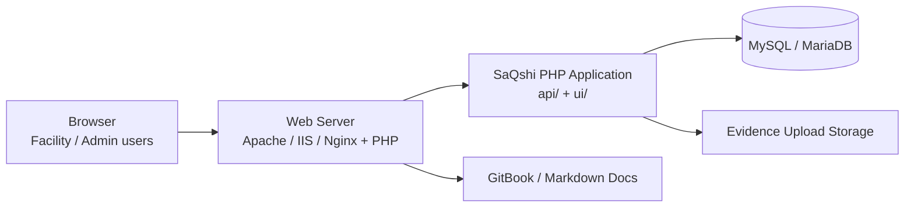

## Event-Driven Extension Point

SaQshi currently keeps deployment simple by dispatching events locally. The same
application code can later publish these events to Kafka or another broker.

Example:

```php
Event::dispatch('assessment.completed', $assessmentData);
Event::dispatch('gap.closed', $closureData);
Event::dispatch('certification.updated', $certificationData);
```

Current behavior:

- Log events under local event storage.
- Allow local listeners or audit logic.
- Keep API code independent of Kafka.

Future behavior:

- Change the event dispatcher implementation.
- Publish events to Kafka topics.
- Keep existing API and service calls unchanged.

## Security and Release Boundaries

- `.env` holds environment-specific secrets and must not be committed.
- `api/assets/conn/db.php` reads database settings from `.env`.
- APIs should return friendly error responses, not raw database/PHP errors.
- Database access should use prepared statements.
- Upload APIs validate file type and path handling.
- Role-specific UI and APIs must restrict facility, block, district, division and state data appropriately.
- Open-source release files live at the project root and under `docs/compliance`.

## Related Documents

- [API Developer Documentation](../api/README.md)
- [Configuration JSON Formats](configuration_formats.md)
- [Service Architecture and Map](service_map.md)
- [AI Chat Assistant Architecture](ai_chat_assistant_architecture.md)
- [Database Setup and Migration](../database/database_setup_and_migration.md)
- [SQL Injection Security Review](../security/sql_injection_security_review.md)
- [Open Source Readiness Checklist](../compliance/open_source_readiness_checklist.md)
- [GitBook Publishing Guide](../gitbook.md)
