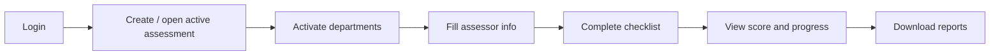
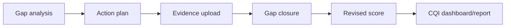
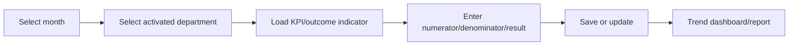
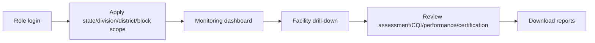
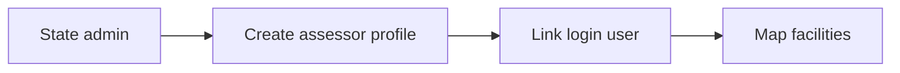
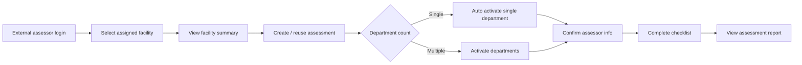

# SaQshi Use Cases

Version: 1.0  
Updated: 2026-07-16  
License: GPL-3.0

## Purpose

This document explains the main practical use cases supported by SaQshi. It is intended for programme teams, facility users, monitoring users, developers and implementation partners who need to understand what the platform is used for and which users perform each action.

## Actors

| Actor | Main Responsibility |
| --- | --- |
| Facility User | Creates and completes facility-level assessment, CQI, performance and certification activities assigned to the facility. |
| Block User | Monitors facilities within the assigned block and reviews progress, gaps and reports. |
| District User | Monitors district-level assessment, CQI, performance, certification and facility progress. |
| Division / Regional User | Reviews multiple districts and supports programme monitoring across a larger administrative area. |
| State Admin / State User | Reviews statewide monitoring, certification, analytics, reports and user administration. |
| External Assessor | Performs assessment for facilities mapped by state administration. |
| System Admin / Maintainer | Configures framework JSON, deployment, database, integrations and release operations. |
| Developer | Extends APIs, UI pages, services, reports, configuration formats and documentation. |

## Use Case Summary

| ID | Use Case | Primary Actor | Outcome |
| --- | --- | --- | --- |
| UC-01 | Login and access role-specific dashboard | All users | User sees only permitted menus and data scope. |
| UC-02 | Create a new assessment | Facility User | New assessment is created when no active assessment exists. |
| UC-03 | Cancel active assessment | Facility User | Current active assessment is cancelled so a fresh assessment can be started. |
| UC-04 | Activate departments | Facility User | Applicable departments are enabled for the active assessment. |
| UC-05 | Fill assessor information | Facility User | Department-wise assessor, assessee, date and assessment type are saved. |
| UC-06 | Complete checklist responses | Facility User | Checkpoints are scored as non-compliance, partial compliance or full compliance. |
| UC-07 | Track assessment progress | Facility / Monitoring Users | Completed and pending checkpoints are visible with progress status. |
| UC-08 | Generate score report | Facility / Monitoring Users | Checklist and scorecard reports are downloaded in required format. |
| UC-09 | Perform gap analysis | Facility User | Non-compliant/partially compliant checkpoints become gaps. |
| UC-10 | Create action plan | Facility User | Gap-wise action plan, responsible person and target date are saved. |
| UC-11 | Upload evidence | Facility User | Evidence file is attached to action plan or gap closure where needed. |
| UC-12 | Close gap | Facility User | Gap closure status and revised score are updated. |
| UC-13 | Enter KPI data | Facility User | Monthly KPI numerator, denominator, result and remarks are saved. |
| UC-14 | Enter outcome data | Facility User | Monthly outcome indicator data is saved for active departments. |
| UC-15 | View performance trends | Facility / Monitoring Users | Month-wise KPI/outcome trend is visible and downloadable. |
| UC-16 | Update facility profile | Facility User | Facility contact, NIN and geo details are updated with validation. |
| UC-17 | Update user profile | Facility User | User details and password are updated securely. |
| UC-18 | Track certification status | Monitoring Users | Certification status, type, score and validity are visible. |
| UC-19 | Update certification | State / Authorized User | Certification history is updated for a facility. |
| UC-20 | View certification map | State / Monitoring Users | Certified facilities are plotted on configured map boundaries. |
| UC-21 | Monitor state/district/block progress | Monitoring Users | Administrative dashboards show facility, assessment, CQI, performance and certification summaries. |
| UC-22 | Drill down facility data | Monitoring Users | User navigates state to division to district to block to facility details. |
| UC-23 | Manage users | State Admin | Users can be searched, activated, deactivated and managed. |
| UC-24 | Download state reports | State Admin / Monitoring Users | Facility, assessment, CQI, performance and certification reports are exported. |
| UC-25 | Manage assessor profiles | State Admin | Assessor master profile is created/updated and linked to a login user. |
| UC-26 | Map assessor to facilities | State Admin | One assessor is assigned to one or more facilities for assessment. |
| UC-27 | Perform mapped facility assessment | External Assessor | Assessor selects an assigned facility and completes the normal assessment workflow. |
| UC-28 | Configure framework JSON | Maintainer / Developer | New departments, concerns, checkpoints and frameworks are configured without rewriting UI logic. |
| UC-29 | Configure performance indicators | Maintainer / Developer | KPI/outcome indicators, formulas and validation rules are managed from JSON. |
| UC-30 | Use GitBook documentation | All users / Developers | User guide, developer guide, API docs, testing and deployment docs are available. |

## Core User Flows

### Facility Assessment Flow

### CQI Flow

### Performance Monitoring Flow

### State Monitoring Flow

### State Admin Assessor Setup Flow

### External Assessor Assessment Flow

## Detailed Use Cases

### UC-01 Login and Role-Specific Dashboard

**Primary actors:** Facility User, Block User, District User, Division User, State User, Admin  
**Precondition:** User exists and is active.  
**Main flow:**

1. User opens the login page.
2. User enters credentials and captcha.
3. API validates login and creates session.
4. UI loads menus based on `role_id`.
5. User sees dashboard scoped to their role.

**Expected result:** Facility users see facility workflows. State/district/block users see monitoring workflows only.

### UC-02 Create Assessment

**Primary actor:** Facility User  
**Precondition:** No active assessment exists for the facility.  
**Main flow:**

1. User opens Create Assessment.
2. System checks active assessment availability.
3. System generates the assessment name from facility, framework and month.
4. User confirms or edits the name, framework, start date and end date.
5. API saves the assessment.
6. User proceeds to department activation.

**Alternative flow:** If an active assessment exists, user must complete or cancel it before creating another.

### UC-04 Activate Departments

**Primary actor:** Facility User  
**Precondition:** Active assessment exists.  
**Main flow:**

1. User opens Departments.
2. System loads departments applicable to facility type and framework.
3. User activates relevant departments.
4. Activated departments are saved for the assessment.
5. Activated departments become available for assessor info, checklist, CQI and performance where applicable.

### UC-06 Complete Checklist Responses

**Primary actor:** Facility User  
**Precondition:** Department is activated and assessor information is available.  
**Main flow:**

1. User selects department, area of concern, subtype and optional assessment method.
2. System loads one checkpoint at a time.
3. User selects score: `0`, `1`, or `2`.
4. User enters remarks/evidence where applicable.
5. User clicks Save and Next.
6. Progress count updates for completed and remaining checkpoints.

**Expected result:** Checklist progress and score are updated. Completed area of concern shows completion message with edit/update option.

### UC-10 Create Action Plan

**Primary actor:** Facility User  
**Precondition:** Gaps exist from checklist responses.  
**Main flow:**

1. User opens Action Plan.
2. User filters by department, concern, subtype or all departments.
3. System shows checkpoint and suggested action plan.
4. User enters or copies action plan, responsible person, target date and remarks.
5. User saves and moves to next checkpoint.

**Expected result:** Action plan is saved and appears in CQI monitoring and reports.

### UC-12 Close Gap

**Primary actor:** Facility User  
**Precondition:** Action plan exists.  
**Main flow:**

1. User opens Gap Closure.
2. User reviews action plan and checkpoint.
3. User uploads evidence if available.
4. User updates status, remarks and revised score.
5. User saves closure.

**Expected result:** Gap is marked completed/pending/overdue as applicable and revised score contributes to CQI progress.

### UC-13 / UC-14 KPI and Outcome Entry

**Primary actor:** Facility User  
**Precondition:** Active assessment and activated department exist where required.  
**Main flow:**

1. User selects month and department.
2. System loads indicators applicable to facility type and department.
3. User enters numerator, denominator, result and remarks.
4. If denominator is configured as `N/A`, denominator field is read-only.
5. User saves and moves next.

**Expected result:** Monthly performance entry is saved and trend dashboards update.

### UC-18 / UC-19 Certification Tracking

**Primary actors:** State User, Authorized Monitoring User  
**Precondition:** Facility exists and has NIN/facility identity.  
**Main flow:**

1. User opens Certification Status.
2. System loads facility certification history.
3. User reviews status, type, score, valid from and expiry date.
4. Authorized user updates certification details.
5. System writes certification history.

**Expected result:** Certification dashboard and map reflect latest certification state.

### UC-21 State Monitoring

**Primary actors:** State, Division, District and Block Users  
**Precondition:** User has role and administrative scope.  
**Main flow:**

1. User logs in.
2. System applies administrative scope.
3. Dashboard loads facility categories, certification status and current month status.
4. User searches by facility name or NIN.
5. User opens drill-down or downloads reports.

**Expected result:** User can monitor only permitted facilities without loading all records at once.

### UC-25 Manage Assessor Profiles

**Primary actor:** State Admin  
**Precondition:** Assessor login user exists or will be created separately.  
**Main flow:**

1. State admin opens Assessor Management.
2. State admin enters assessor code, name, designation, mobile and email.
3. If linked user ID is blank, SaQshi creates a login user automatically.
4. Username is the assessor code.
5. SaQshi generates a temporary password, hashes it in the database and sends it through configured email/SMS service hooks.
6. API encrypts assessor name, mobile and email before saving.
7. Assessor profile becomes available for facility mapping.

**Expected result:** Assessor master profile is stored securely and can be mapped to facilities.

### UC-26 Map Assessor to Facilities

**Primary actor:** State Admin  
**Precondition:** Assessor profile exists and facility exists.  
**Main flow:**

1. State admin selects an assessor.
2. State admin searches facility by facility name, NIN, district or block.
3. State admin assigns one or more facilities to the assessor.
4. System stores active facility mappings.

**Expected result:** The assessor can see only mapped active facilities after login.

### UC-27 Perform Mapped Facility Assessment

**Primary actor:** External Assessor  
**Precondition:** Assessor profile is active and mapped to at least one active facility.  
**Main flow:**

1. Assessor logs in.
2. If the account has a temporary password, SaQshi requires password change in My Profile.
3. Assessor dashboard shows mapped facilities.
4. Assessor selects one facility.
5. System validates the mapping.
6. System creates a new active assessment or reuses the existing active assessment.
7. If only one department applies, system auto-activates it.
8. If multiple departments apply, system opens department activation.
9. Assessor continues with assessor info, checklist entry and assessment reports. CQI/action-plan/closure information is view-only where shown.

**Expected result:** State-led assessment is completed using the existing SaQshi assessment workflow while remaining limited to mapped facilities.

## Configuration Use Cases

| Use Case | Configuration File / Area | Purpose |
| --- | --- | --- |
| Add facility master data | `api/config/masters/facilities.json` or database import | Load facility details and facility type metadata. |
| Add department master | `department.json` / framework JSON | Show correct department names and activated departments. |
| Add checklist framework | `api/config/frameworks/*.json` | Define standards, measurable elements, checkpoints and scoring. |
| Add KPI/outcome indicators | `api/config/performance/*.json` | Configure indicators, formulas, validation and outcome-as-KPI behavior. |
| Configure map boundaries | `api/config/masters/map.json` | Plot configured state/district boundaries and certified facilities. |
| Configure validation rules | `api/config/performance/validation.json` and endpoint validation | Enforce required fields and safe input values. |

## Non-Functional Use Cases

| Area | Use Case |
| --- | --- |
| Security | Prevent raw database/PHP errors from reaching users. |
| Privacy | Store credentials in `.env`; protect sensitive user/facility data. |
| Audit | Dispatch important events and keep audit-ready records. |
| Accessibility | Support readable UI, keyboard navigation and screen-reader mode. |
| Performance | Use pagination/search for large facility lists and state-level data. |
| Backup | Preserve database, uploads, reports and configuration before upgrade. |
| Open-source release | Maintain license, notice, security, changelog and release checklist. |

## Related Documents

- [User Guide](../user/user_guide.md)
- [Project Overview and NQAS Alignment](project_overview.md)
- [Technical Architecture Overview](technical_architecture.md)
- [Service Architecture and Map](service_map.md)
- [Configuration JSON Formats](configuration_formats.md)
- [API Developer Documentation](../api/README.md)
