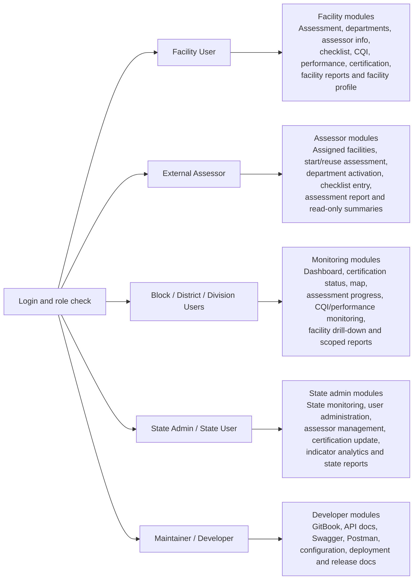
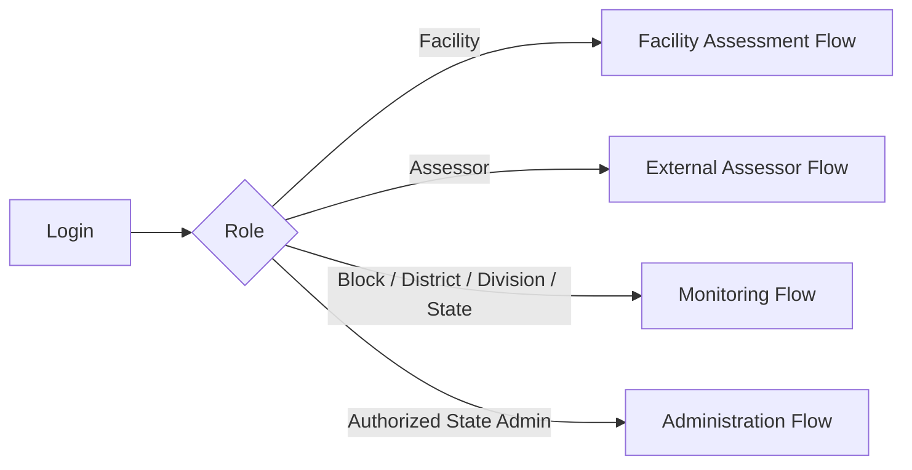
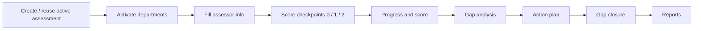
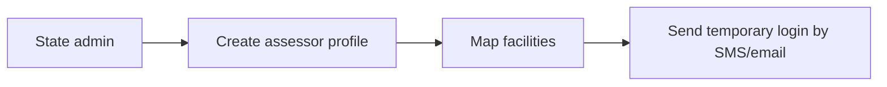
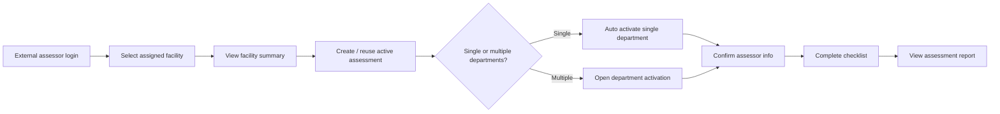
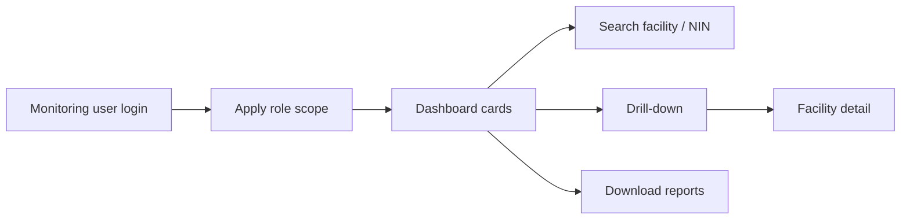
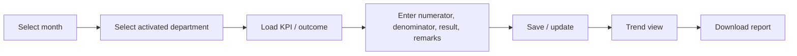
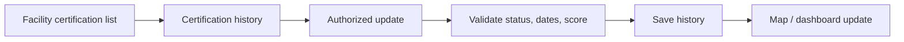

# User and Module View

Version: 1.0  
Updated: 2026-07-18  
License: GPL-3.0

## Purpose

This page explains which users access which SaQshi modules and how the major
workflows move from one module to another. It is a functional architecture
view, useful for programme teams, developers, testers and implementers.

## User to Module Access View



The exact page-by-page permissions are listed in the matrix below. This diagram
is intentionally high level so implementers can quickly understand which menu
group belongs to each user type.

## Role and Module Matrix

| Module | Facility User | Assessor | Block | District | Division | State |
| --- | --- | --- | --- | --- | --- | --- |
| Dashboard | Facility dashboard | Assessor dashboard | Scoped monitoring | Scoped monitoring | Scoped monitoring | State monitoring |
| Create assessment | Yes | Via mapped facility start | View only | View only | View only | View only |
| Department activation | Yes | Mapped facility only | No | No | No | No |
| Assessor info | Yes | Mapped facility only | View only | View only | View only | View only |
| Checklist | Yes | Mapped facility only | View only | View only | View only | View only |
| Gap analysis | Yes | View only for mapped facility | View only | View only | View only | View only |
| Action plan | Yes | View only for mapped facility | View only | View only | View only | View only |
| Gap closure | Yes | View only for mapped facility | View only | View only | View only | View only |
| KPI/outcome entry | Yes | View only for mapped facility | View only | View only | View only | View only |
| Certification | Facility view | Mapped facility view | Scoped view | Scoped view | Scoped view | Authorized update |
| State reports | No | No | Scoped downloads | Scoped downloads | Scoped downloads | State downloads |
| User administration | No | No | No | No | No | Authorized state users |
| Assessor management | No | No | No | No | No | Authorized state users |

## Main End-to-End Flow



## Facility Assessment Module Flow



## State Admin Assessor Setup Flow



## External Assessor Module Flow



## Monitoring Module Flow



## Performance Module Flow



## Certification Module Flow



## Developer View

Every UI module generally follows this structure:

```text
ui/pages/<module>/<page>.html
ui/pages/<module>/<page>.js
ui/pages/<module>/<page>.css
ui/pages/<module>/<page>.json
```

Every API module generally follows this structure:

```text
api/<module>/v1/<endpoint>.php
api/service/<ModuleService>.php
api/config/<module>/*.json
```

The page JSON manifest connects the route to the page assets. Page JavaScript
calls versioned API endpoints through `SQ.api`. APIs validate session/CSRF and
delegate business logic to services.
