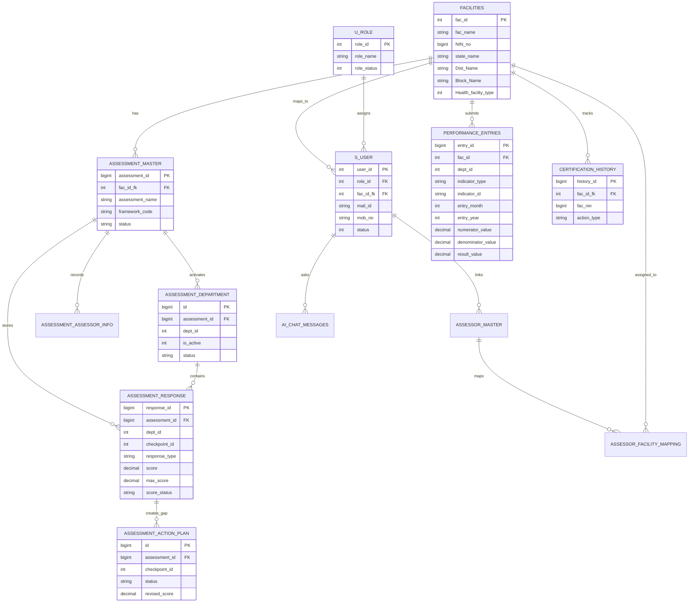

# Data Dictionary and ER Diagram

This document provides a first-pass data dictionary and ERD for SaQshi. Table and column names should be verified against the active migration scripts before production release.

## Core Entity Relationship Diagram

## Main Tables

| Table | Purpose |
| --- | --- |
| `facilities` | Facility master data, geography, NIN, type and coordinates. |
| `s_user` | Application users, role mapping and facility mapping. |
| `u_role` | Role definitions such as facility, block, district, division and state. |
| `assessment_master` | Main assessment record for a facility. |
| `assessment_department` | Activated departments and department-level assessment status. |
| `assessment_department_status` | Department activation status used by activation/list workflows. |
| `assessment_assessor_info` | Assessor and assessee details by assessment and department. |
| `assessment_response` | Checklist checkpoint responses, baseline scores and structured response metadata. |
| `assessment_response_field_index` | Indexed structured checkpoint fields for future analytics. |
| `assessment_response_evidence` | Field/checkpoint-level evidence file references. |
| `assessment_action_plan` | CQI action plans, target dates, responsible person and revised score. |
| `assessment_action_plan_library` | Reusable facility/user suggested action plans by checkpoint. |
| `performance_entries` | Monthly KPI/outcome indicator values. |
| `cert_details` | Current certification records. |
| `certification_history` | Certification change history and audit data. |
| `assessor_master` | State-created assessor profiles. |
| `assessor_facility_mapping` | Assessor-to-facility mapping for external/state assessments. |
| `ai_chat_messages` | AI chat assistant history and fallback/intention audit. |
| `login_attempts` | Login throttling/failed-attempt tracking. |

## Key Relationships

| Relationship | Meaning |
| --- | --- |
| Facility to user | A facility user is mapped to one facility through `fac_id_fk`. |
| Facility to assessment | A facility may have many assessments over time. |
| Assessment to department | An assessment activates one or more departments. |
| Assessment to response | Checkpoint responses are stored against the assessment. |
| Response to action plan | Score 0/1 responses can become CQI gaps with action plans. |
| Action plan to closure | Closure is tracked on `assessment_action_plan` with status, revised score, closure remarks and evidence URL. |
| Facility to performance | Facilities submit monthly KPI/outcome data in `performance_entries`. |
| Facility to certification | Certification history is linked by facility id and/or NIN. |
| Assessor to facility | State-created assessors can be mapped to multiple facilities. |

## Scoring Notes

| Score | Meaning |
| --- | --- |
| 0 | Non-compliance |
| 1 | Partial compliance |
| 2 | Full compliance |

Baseline score comes from `assessment_response.score`. Improved score uses `assessment_action_plan.revised_score` when available. A compatibility view named `assessment_cycle_response` is included for older report code paths.
