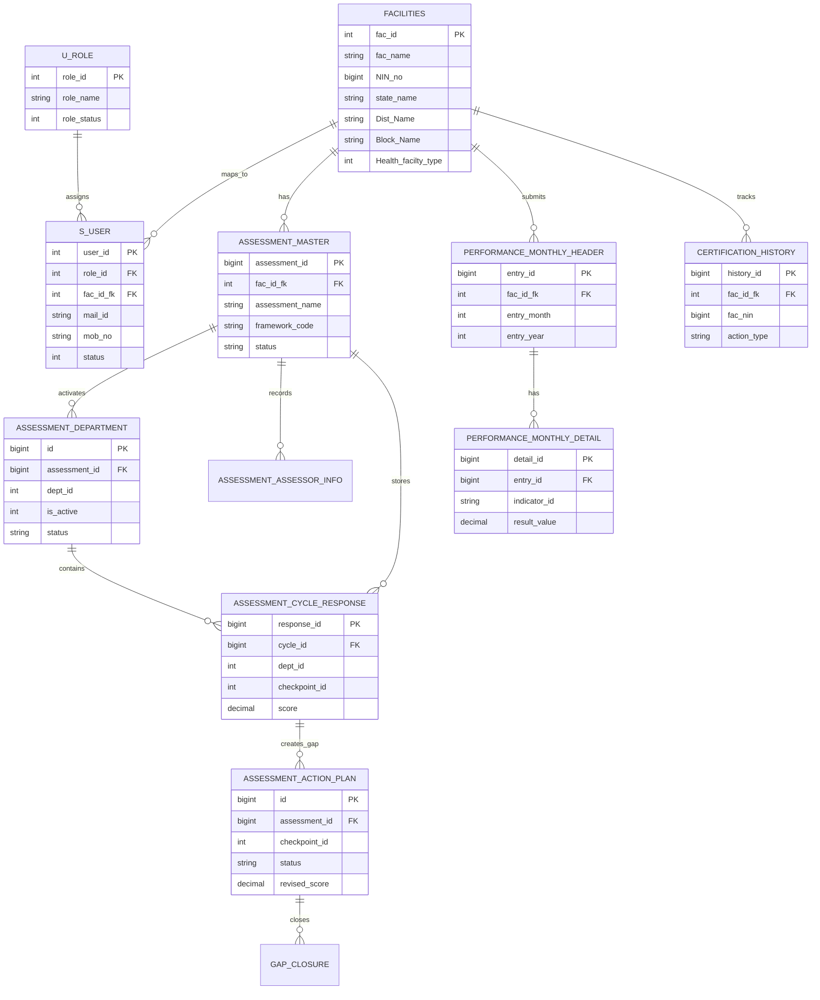

# Data Dictionary and ER Diagram

This document provides a first-pass data dictionary and ERD for SaQshi. Table and column names should be verified against the active migration scripts before production release.

## Core Entity Relationship Diagram

## Main Tables

| Table | Purpose |
| --- | --- |
| `facilities` | Facility master data, geography, NIN, type and coordinates. |
| `s_user` | Application users, role mapping and facility mapping. |
| `u_role` | Role definitions such as facility, block, district, division and state. |
| `assessment_master` | Main assessment record for a facility. |
| `assessment_department` | Activated departments and department-level assessment status. |
| `assessment_assessor_info` | Assessor and assessee details by assessment and department. |
| `assessment_cycle_response` | Checklist checkpoint responses and baseline scores. |
| `assessment_action_plan` | CQI action plans, target dates, responsible person and revised score. |
| `performance_monthly_header` | Monthly KPI/outcome submission header. |
| `performance_monthly_detail` | Indicator-level monthly performance values. |
| `certification_history` | Certification change history and audit data. |

## Key Relationships

| Relationship | Meaning |
| --- | --- |
| Facility to user | A facility user is mapped to one facility through `fac_id_fk`. |
| Facility to assessment | A facility may have many assessments over time. |
| Assessment to department | An assessment activates one or more departments. |
| Assessment to response | Checkpoint responses are stored against the assessment cycle. |
| Response to action plan | Score 0/1 responses can become CQI gaps with action plans. |
| Action plan to closure | Closure records revised score and completion evidence/status. |
| Facility to performance | Facilities submit monthly KPI/outcome data. |
| Facility to certification | Certification history is linked by facility id and/or NIN. |

## Scoring Notes

| Score | Meaning |
| --- | --- |
| 0 | Non-compliance |
| 1 | Partial compliance |
| 2 | Full compliance |

Baseline score comes from `assessment_cycle_response.score`. Improved score uses `assessment_action_plan.revised_score` when available.
