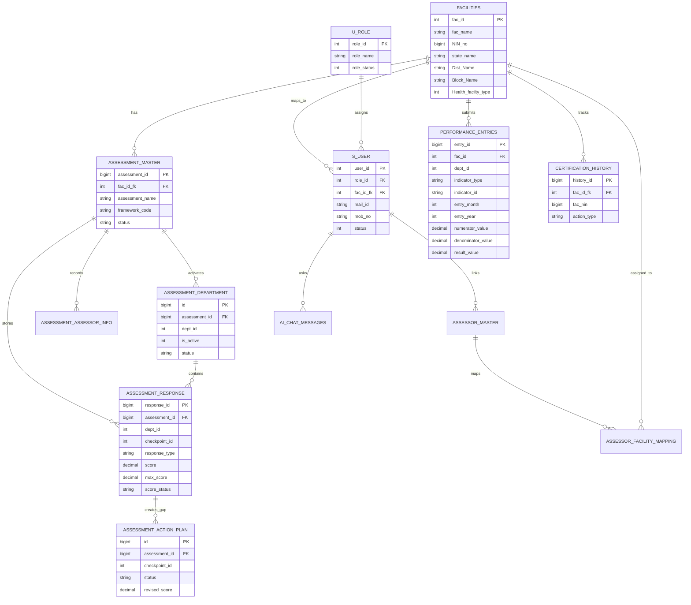

# Data Dictionary and ER Diagram

Version: 1.1
Updated: 2026-08-26

This document provides a maintained high-level data dictionary and ERD for SaQshi. The sanitized base schema at `api/sql/schema/001_base_schema.sql` is the authoritative public installation reference; deployment migrations and the active database remain the authority for exact columns, indexes, constraints and compatibility objects.

SaQshi supports healthcare, education and generic-inspection deployments. Physical table names retain established healthcare-oriented terms such as `facilities`, `NIN_no` and `assessment_department`; the active deployment profile supplies presentation labels such as School/UDISE/Class where configured. Do not rename database columns solely to change UI terminology.

## Core Entity Relationship Diagram

```mermaid
erDiagram
    FACILITIES ||--o{ S_USER : maps_to
    U_ROLE ||--o{ S_USER : assigns
    FACILITIES ||--o{ ASSESSMENT_MASTER : has
    ASSESSMENT_MASTER ||--o{ ASSESSMENT_DEPARTMENT : activates
    ASSESSMENT_MASTER ||--o{ ASSESSMENT_ASSESSOR_INFO : records
    ASSESSMENT_MASTER ||--o{ ASSESSMENT_RESPONSE : stores
    ASSESSMENT_DEPARTMENT ||--o{ ASSESSMENT_RESPONSE : contains
    ASSESSMENT_RESPONSE ||--o{ ASSESSMENT_ACTION_PLAN : creates_gap
    FACILITIES ||--o{ PERFORMANCE_ENTRIES : submits
    FACILITIES ||--o{ CERTIFICATION_HISTORY : tracks
    S_USER ||--o{ ASSESSOR_MASTER : links
    ASSESSOR_MASTER ||--o{ ASSESSOR_FACILITY_MAPPING : maps
    FACILITIES ||--o{ ASSESSOR_FACILITY_MAPPING : assigned_to
    S_USER ||--o{ AI_CHAT_MESSAGES : asks

    FACILITIES {
        int fac_id PK
        string fac_name
        bigint NIN_no
        string state_name
        string Dist_Name
        string Block_Name
        int Health_facilty_type
    }

    S_USER {
        int user_id PK
        int role_id FK
        int fac_id_fk FK
        string mail_id
        string mob_no
        int status
    }

    U_ROLE {
        int role_id PK
        string role_name
        int role_status
    }

    ASSESSMENT_MASTER {
        bigint assessment_id PK
        int fac_id_fk FK
        string assessment_name
        string framework_code
        string status
    }

    ASSESSMENT_DEPARTMENT {
        bigint id PK
        bigint assessment_id FK
        int dept_id
        int is_active
        string status
    }

    ASSESSMENT_RESPONSE {
        bigint response_id PK
        bigint assessment_id FK
        int dept_id
        int checkpoint_id
        string response_type
        decimal score
        decimal max_score
        string score_status
    }

    ASSESSMENT_ACTION_PLAN {
        bigint id PK
        bigint assessment_id FK
        int checkpoint_id
        string status
        decimal revised_score
    }

    PERFORMANCE_ENTRIES {
        bigint entry_id PK
        int fac_id FK
        int dept_id
        string indicator_type
        string indicator_id
        int entry_month
        int entry_year
        decimal numerator_value
        decimal denominator_value
        decimal result_value
    }

    CERTIFICATION_HISTORY {
        bigint history_id PK
        int fac_id_fk FK
        bigint fac_nin
        string action_type
    }
```

## Main Tables

| Table | Purpose |
| --- | --- |
| `facilities` | Facility master data, geography, NIN, type and coordinates. |
| `s_user` | Application users, role mapping and facility mapping. |
| `u_role` | Role definitions such as facility, block, district, division and state. |
| `assessment_master` | Main assessment record for a facility. |
| `assessment_department` | Activated departments and department-level assessment status. |
| `assessment_department_status` | Department activation status used by activation/list workflows. |
| `assessment_assessor_info` | Assessor and assessee details by assessment and department. |
| `assessment_response` | Checklist checkpoint responses, baseline scores and structured response metadata. |
| `assessment_response_field_index` | Indexed structured checkpoint fields for future analytics. |
| `assessment_response_evidence` | Field/checkpoint-level evidence file references. |
| `assessment_action_plan` | CQI action plans, target dates, responsible person and revised score. |
| `assessment_action_plan_library` | Reusable facility/user suggested action plans by checkpoint. |
| `performance_entries` | Monthly KPI/outcome indicator values. |
| `cert_details` | Current certification records. |
| `certification_history` | Certification change history and audit data. |
| `assessor_master` | State-created assessor profiles. |
| `assessor_facility_mapping` | Assessor-to-facility mapping for external/state assessments. |
| `ai_chat_messages` | AI chat assistant history and fallback/intention audit. |
| `login_attempts` | Login throttling/failed-attempt tracking. |

## Data Classification and Handling Boundary

| Data area | Classification | Handling rule |
| --- | --- | --- |
| `s_user` contact and account fields | Restricted operational personal data | Access only through authenticated, role-scoped workflows; do not include in public sample data or logs. |
| `facilities` master data and geography | Deployment-sensitive operational data | Public redistribution of real facility names, NIN/UDISE-style identifiers or hierarchy requires data-owner approval. |
| Assessment, CQI, performance and certification records | Restricted programme/quality data | Apply facility/geography role scope; export only through approved reports and data-sharing policy. |
| Evidence references and uploads | Restricted, potentially sensitive | Store outside publicly browsable paths; redact/approve before sharing. Do not upload patient, student or other personal information. |
| Configuration/framework JSON | Public-source candidate after review | Keep secrets and production-only values out of source; review any master data before publication. |
| Public sample exports | Public, fictional | Use only the approved files under `docs/compliance/sample_exports/`; never substitute a local runtime export. |

SaQshi is not a patient-record system. Patient-level health information, credentials, session values, passwords, tokens, raw logs and production database extracts must not be stored in public documentation, sample exports or release artifacts.

## Key Relationships

| Relationship | Meaning |
| --- | --- |
| Facility to user | A facility user is mapped to one facility through `fac_id_fk`. |
| Facility to assessment | A facility may have many assessments over time. |
| Assessment to department | An assessment activates one or more departments. |
| Assessment to response | Checkpoint responses are stored against the assessment. |
| Response to action plan | Score 0/1 responses can become CQI gaps with action plans. |
| Action plan to closure | Closure is tracked on `assessment_action_plan` with status, revised score, closure remarks and evidence URL. |
| Facility to performance | Facilities submit monthly KPI/outcome data in `performance_entries`. |
| Facility to certification | Certification history is linked by facility id and/or NIN. |
| Assessor to facility | State-created assessors can be mapped to multiple facilities. |

## Scoring Notes

| Score | Meaning |
| --- | --- |
| 0 | Non-compliance |
| 1 | Partial compliance |
| 2 | Full compliance |

Baseline score comes from `assessment_response.score`. Improved score uses `assessment_action_plan.revised_score` when available. A compatibility view named `assessment_cycle_response` is included for older report code paths.

## Schema Verification and Change Control

For a fresh installation, use `api/sql/schema/001_base_schema.sql` together with the database setup guide. Do not use a live production database as a schema source or as sample data.

Before approving a database change:

1. Review the relevant migration and update `api/sql/schema/001_base_schema.sql` when the public base schema changes.
2. Update this dictionary, the SQL query inventory and any API/report contract affected by the change.
3. Test a clean installation using sanitized data only.
4. Confirm role-scoped reads/writes, export fields, backups and retention settings.
5. Record any deployment-specific seed data separately; never commit real users, facilities, assessments, evidence, logs or credentials.

Related references: [Database Setup and Migration](database_setup_and_migration.md), [SQL Query Inventory](sql_query_inventory.md), [Non-PII Export and Import](../compliance/non_pii_data_export_import.md), and [Deployment Profile Configuration](../deployment/deployment_profiles.md).
