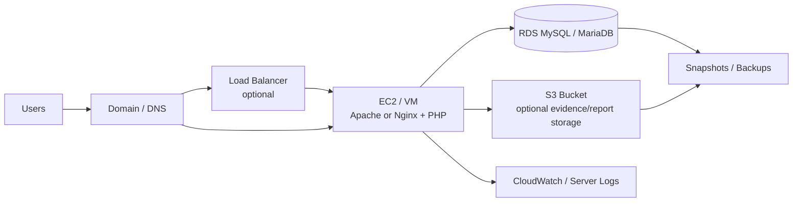

# Deployment Guide

This guide explains how to deploy SaQshi on common PHP web servers. Adjust paths, domains and credentials for your environment.

## Common Requirements

| Requirement | Recommended |
| --- | --- |
| PHP | PHP 8.2+ |
| Database | MySQL or MariaDB |
| Web server | IIS, Apache or Nginx |
| PHP extensions | mysqli, openssl, json, mbstring, fileinfo, zip |
| Writable folders | `uploads/`, `api/storage/logs/`, `api/storage/events/` |
| Secrets | Store in `.env`, not in committed PHP files |

For environment sizing, server capacity, PHP settings, database sizing and UAT/production readiness, see [System Requirements for UAT and Production](system_requirements.md).

## Deployment Steps

1. Copy the project to the web root or application folder.
2. Create `.env` from `.env.example`.
3. Configure database credentials and application environment.
4. Import schema and apply migration scripts.
5. Confirm writable permissions for upload and log folders.
6. Configure the web server document root to the project root.
7. Confirm `{main_url}/ui/login.html` opens.
8. Confirm `{main_url}/api/auth/v1/csrf.php` returns JSON.
9. Login with a test user and verify dashboard routing.

## UI Deployment

The web UI is a static HTML/CSS/JavaScript application under `ui/`. It should be deployed with the API under the same `{main_url}` so sessions, CSRF validation and relative API calls work reliably.

Important UI URLs:

```text
{main_url}/ui/login.html
{main_url}/ui/dashboard.html
{main_url}/ui/help/documentation.html
```

Most routed feature pages are loaded by `ui/dashboard.html` using route query strings, for example:

```text
{main_url}/ui/dashboard.html?route=assessment/checklist
```

See [UI Deployment Guide](ui_deployment_guide.md) for static asset setup, page manifests, same-origin rules, server examples, cache/versioning and UI troubleshooting.

## IIS

Recommended setup:

- Enable IIS CGI/FastCGI.
- Install PHP and configure it through IIS Manager.
- Add MIME mappings for `.md`, `.yaml`, `.yml` and `.json` if GitBook documents are served directly.
- Use `web.config` for static documentation MIME support.
- Ensure the IIS application pool identity can write to `uploads/` and `api/storage/`.

Checklist:

- PHP is mapped correctly.
- `web.config` is deployed.
- Request size allows evidence uploads.
- Directory browsing is disabled.
- `.env` is not publicly downloadable.

## Apache

Recommended setup:

- Enable PHP module or PHP-FPM.
- Enable `mod_rewrite` if future routing rules are added.
- Use virtual host document root pointing to the SaQshi root.
- Protect `.env` with server configuration.

Example hardening:

```apache
<Files ".env">
    Require all denied
</Files>
```

## Nginx

Recommended setup:

- Use PHP-FPM.
- Route `.php` requests to PHP-FPM.
- Serve static files directly.
- Deny access to `.env`.

Example hardening:

```nginx
location ~ /\.env {
    deny all;
}
```

## Cloud / AWS Deployment

SaQshi can be deployed on a cloud VM or managed cloud services. The simplest cloud deployment is a virtual machine running Apache/Nginx/IIS, PHP and access to a managed MySQL database.

### Infrastructure Architecture


### Release and Deployment Architecture


This is the current recommended release flow for SaQshi. It uses Git, release validation, ZIP/Git-pull/SFTP style deployment, database backup, `.env` secrets and Dev/UAT/Production promotion.

### Simple AWS Reference Architecture



### AWS Options

| Layer | AWS Option | Notes |
| --- | --- | --- |
| Compute | EC2 | Easiest path for PHP application deployment. |
| Database | RDS MySQL/MariaDB | Recommended over running DB on the same VM for production. |
| File storage | EBS or S3 | EBS is simple; S3 is better for scalable evidence/report storage. |
| HTTPS | ACM + Load Balancer or web server certificate | Use HTTPS in production. |
| Logs | CloudWatch or server log rotation | Keep PHP/web server/API logs monitored. |
| Backup | RDS automated backups, snapshots, S3 versioning | Test restore regularly. |
| Secrets | `.env`, AWS Secrets Manager, or Parameter Store | Do not commit secrets. |

### Cloud Deployment Steps

1. Create a VM/EC2 instance with PHP and Apache/Nginx.
2. Create a managed database such as RDS MySQL/MariaDB.
3. Restrict database access to the application server security group/IP.
4. Upload SaQshi code to the application server.
5. Create `.env` with cloud database credentials.
6. Configure HTTPS.
7. Set writable permissions for `uploads/` and `api/storage/`.
8. If using S3 for evidence, configure upload service changes and credentials securely.
9. Configure automated database backups.
10. Configure application/server log retention.
11. Verify `{main_url}/ui/login.html` and core APIs.

### Cloud Security Checklist

- Database is not publicly open.
- SSH/RDP access is restricted.
- HTTPS is enabled.
- `.env` is protected.
- Backups are enabled.
- Upload file size and type limits are configured.
- Logs do not expose passwords, database errors or sensitive records.
- Least-privilege IAM permissions are used for S3 or other cloud services.

### Other Cloud Providers

The same pattern can be used on Azure, Google Cloud, NIC cloud or any private cloud:

```text
Users -> Domain/HTTPS -> Web VM or App Service -> Managed MySQL/MariaDB -> Object/File Storage -> Backups/Logs
```

## Post Deployment Verification

| Check | Expected Result |
| --- | --- |
| Login page | Loads without console errors |
| CSRF API | Returns JSON success response |
| Login API | Starts a secure session |
| Dashboard | Loads role-based menus |
| Upload API | Accepts allowed evidence files |
| GitBook | Markdown pages render as HTML |
| Swagger | Opens from the same `{main_url}` host |

## Production Notes

- Use HTTPS.
- Use strong database passwords.
- Keep `.env` outside public download access.
- Disable PHP error display in production.
- Review upload limits and allowed file types.
- Schedule database and upload backups.
- Rotate logs and monitor API error logs.
