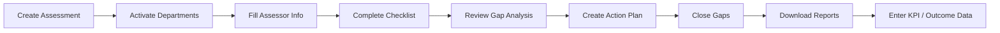
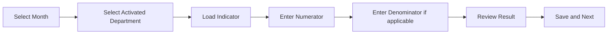

# SaQshi User Guide

Version: 1.0  
Updated: 2026-07-18  
License: GPL-3.0

## Purpose

This guide explains how a normal SaQshi user works in the application. It is
written for facility users, block users, district users, division users and
state users.

Use this guide when you want to know:

- where to go,
- what each page is used for,
- what action you should perform,
- what common messages mean,
- what to do if something does not load.

## Important Data Entry Rule

SaQshi is for facility quality assessment and monitoring. It is not a patient record system.

Do not enter patient-level personal health information anywhere in SaQshi, including:

- patient name,
- patient ID or registration number,
- case-sheet details,
- diagnosis or clinical history linked to a person,
- lab report or prescription linked to a person,
- patient photograph or patient-identifiable evidence.

Use SaQshi for facility-level observations, checklist scores, CQI actions, evidence of system/process improvement, KPI/outcome numbers and monitoring reports. If any evidence document accidentally contains patient-identifiable information, do not upload it until it is redacted or cleared by the deployment owner.

## Login

Open the application:

```text
{main_url}/ui/login.html
```

On the login page:

1. Enter user name.
2. Enter password.
3. Complete captcha.
4. Click login.

If login is successful, SaQshi opens the dashboard according to your role.

SaQshi login uses the value stored in `s_user.u_name`. It does not login by
display name, assessor name, mobile number or email unless that value has been
created as the actual `u_name`. For assessor users, the expected login user name
is normally the assessor code created by state administration.

### Screen Reader on Login Page

The login page does not show the authenticated SaQshi header, so the built-in
SaQshi accessibility menu is not available before login.

For login, use your device or browser screen reader:

- Windows Narrator: press `Ctrl + Windows + Enter`.
- NVDA/JAWS: start the screen reader before opening the login page.
- macOS VoiceOver: press `Command + F5`.

The captcha is a text-based math question. It is announced as text and the
captcha input includes help text. If you cannot complete the captcha
independently, contact your administrator for assisted login or password reset.

After login, open the accessibility menu in the top header. From there you can
turn on:

- `Screen reader mode`
- `Read page`
- `Stop`
- text size controls `A--`, `A`, `A+`, `A++`

SaQshi remembers the selected accessibility settings for later authenticated
pages on the same browser.

If login fails:

- Check user name.
- Check password.
- Confirm the user name exists in `s_user.u_name` and the user is active.
- For assessor login, confirm the assessor profile is linked to a user in
  `s_user` and that the assessor code is being used as the login user name.
- Refresh captcha and try again.
- If the message says something went wrong, contact the technical person and share the time of error.

## Main User Types

| User Type | What They Can Usually See |
|---|---|
| Facility User | Facility dashboard, assessment, CQI, performance, reports, profile and facility profile. |
| Block User | Monitoring data for assigned block. |
| District User | Monitoring data for assigned district. |
| Division User | Monitoring data for assigned division/region. |
| State User | State-level monitoring, certification, reports, users and drill-down views. |
| Assessor | Facilities assigned by state administration for assessment entry. |

Menus are role-based. A state user should not see facility assessment-entry
menus. A facility user should not see full state administration menus.

## State-Led Assessor Workflow

This workflow is used when state administration wants one assessor to assess
multiple facilities.

For state admin:

1. Open `State Monitoring > Assessor Management`.
2. Create the assessor profile.
3. Leave linked user ID blank if SaQshi should create the assessor login automatically.
4. SaQshi uses assessor code as username, generates a temporary password and sends it through configured email/SMS service.
5. Search and assign one or more facilities to that assessor.

Before giving login details to the assessor, confirm that a matching user row
exists in `s_user` with `u_name` equal to assessor code, role `Assessor`, active
status and the generated password hash.

For assessor:

1. Login with the assessor user account.
2. If you are using a temporary password, SaQshi opens My Profile and asks you to create a new password.
3. Open `Assessor Dashboard` or `Assigned Facilities`.
4. Select the facility to assess.
5. SaQshi creates or reuses the active assessment for that facility.
6. If only one department applies, SaQshi activates it automatically.
7. If multiple departments apply, SaQshi opens department activation.
8. Continue with assessor info, checklist, CQI and reports.

If department activation and assessor information are already completed, the
assessor dashboard shows `Start Checklist` or `Continue Checklist` directly.
You do not need to repeat the earlier screens.

Use `View` on a mapped facility to see:

- previous assessments for that facility,
- current assessment status and score,
- KPI/outcome months when those modules are enabled.

From the same view, use the performance buttons to open:

- `Performance Dashboard`,
- `Outcome Trend`,
- `KPI Trend`,
- month-wise KPI/outcome charts filled by the facility user.

These buttons appear only when the deployment has performance, KPI and outcome
modules enabled for the healthcare implementation.

Assessor access to KPI/outcome is view-only. Assessors cannot fill or update
KPI/outcome entries, CQI gap closure or action plans. The assessor's work is
assessment entry: department activation where needed, assessor info and
checklist scoring.

Assessment scores saved by the assessor appear in normal facility dashboards,
reports and state/district/division/block monitoring because the result is
stored against the facility assessment.

An assessor can see and assess only the facilities mapped to that assessor
profile.

## Facility User Workflow

Facility users normally follow this flow:



## Dashboard

The dashboard gives a quick view of:

- active assessment,
- assessment progress,
- baseline score,
- final score/progress,
- open gaps,
- department/checkpoint completion,
- KPI/outcome month-wise entry status.

Use dashboard buttons for quick navigation:

- **New Assessment**: go to create assessment.
- **Assessment List**: view previous/current assessments.
- **Reports**: open report dashboard.
- **Continue Assessment**: open checklist for active assessment.

## Create Assessment

Page:

```text
Assessment > Create Assessment
```

Use this page to start a new assessment.

Important rule:

- You can create a new assessment only if no active assessment exists.
- If an active assessment exists, complete or cancel it before creating another one.

Typical fields:

- Assessment name, generated automatically from facility, framework and assessment month
- Framework
- Start date
- End date
- Remarks

You may edit the generated assessment name before saving if your programme uses a local naming format.

If the page says active assessment already exists, use the current assessment or cancel it if your process allows.

## Assessment List

Page:

```text
Assessment > Assessment List
```

Use this page to see:

- all assessments for the facility,
- status: active, completed, cancelled or in progress,
- score,
- continue button.

Continue should take you to the checklist page.

## Activate Departments

Page:

```text
Assessment > Departments
```

Use this page after creating an assessment.

You will see departments applicable to the facility/framework. Activate only
the departments that are applicable.

Rules:

- Activated department shows as activated.
- Button may be locked/disabled after activation for current assessment.
- Only activated departments appear in assessor info, checklist and performance flows.

## Assessor Information

Page:

```text
Assessment > Assessor Info
```

Use this page after department activation.

For each activated department, fill:

- assessor name,
- assessee name,
- date of assessment,
- assessment type.

If information already exists, SaQshi shows saved details. Use edit/update if correction is needed.

## Checklist Assessment

Page:

```text
Assessment > Checklist
```

Use this page to complete checkpoint responses.

Select:

1. Department
2. Area of concern
3. Subtype/standard
4. Assessment method if applicable

Then checkpoints load one by one.

In the healthcare/NQAS profile, response meaning is:

| Score | Meaning |
|---:|---|
| `0` | Non-compliance |
| `1` | Partial compliance |
| `2` | Full compliance |

In other configured domains, the checkpoint may instead show yes/no, dropdown,
number, text or multi-field entry. In those cases, enter the requested value and
use **Save / Update** or **Next** in the same way.

Use:

- **Next** to move to next checkpoint.
- **Back** to go to previous checkpoint.
- **Update/Edit** if checkpoint is already completed and needs correction.

If all checkpoints are completed for an area of concern, SaQshi shows a completion message and gives an edit/update option.

## Gap Analysis

Page:

```text
CQI > Gap Analysis
```

Use this page after checklist entry.

Gap analysis shows checkpoints where score is:

- `0` non-compliance,
- `1` partial compliance.

These are the areas requiring improvement.

## Action Plan

Page:

```text
CQI > Action Plan
```

Use this page to prepare action plans for each gap checkpoint.

SaQshi can show:

- suggested/predefined action plan from checklist JSON,
- earlier user-entered action plans,
- facility name for suggested plan history.

You can:

- copy suggested plan,
- write your own plan,
- choose responsible person,
- choose target date,
- save and next,
- go back,
- update existing plan.

If all checkpoint action plans are completed, SaQshi shows a completion message and gives edit/update option.

## Evidence Upload

Evidence upload is optional unless your process marks it required.

Allowed evidence can include:

- image,
- PDF,
- Word document,
- Excel file,
- camera image.

If wrong file is uploaded, use delete option and upload the correct file.

## Gap Closure

Page:

```text
CQI > Gap Closure
```

Use this page when action is completed.

For each action plan:

- add closure remarks,
- add revised score if applicable,
- attach evidence if available,
- mark status completed.

Closure updates final score/progress.

## Performance Monitoring

Pages:

```text
Performance > Dashboard
Performance > KPI
Performance > Outcome
Performance > Trend
```

Use performance pages for monthly KPI/outcome data entry.

General flow:



Notes:

- Date/month should be selected from calendar/month control.
- If denominator is `N/A`, denominator field may be read-only.
- When all indicators for a month are completed, SaQshi shows a completion message.
- Trend page shows month-wise data and charts.

## Reports

Pages:

```text
Reports > Report Dashboard
Reports > Score
Reports > Progress
State Reports
```

Reports may include:

- checkpoint scorecard,
- progress report,
- action plan and gap closure report,
- performance report,
- facility list,
- assessment details,
- CQI details,
- certification details,
- state monitoring reports.

For file downloads:

1. Click download/report button.
2. Wait for file.
3. Open in Excel/PDF viewer.
4. Check facility name, assessment name, score and status.

## Facility Profile

Page:

```text
Administration > Facility Profile
```

Facility user can view facility details.

If allowed, user can update:

- facility name,
- NIN number,
- facility type,
- address/admin details,
- geo coordinates.

Geo coordinates can use current location. NIN number should not duplicate another facility.

## My Profile

Page:

```text
Administration > My Profile
```

Use this page to update user profile details such as:

- name,
- mobile number,
- email,
- password.

Password should normally contain:

- minimum 8 characters,
- one uppercase letter,
- one lowercase letter,
- one digit,
- one special character.

## State Monitoring

State, division, district and block users see monitoring pages based on their role.

Common pages:

- State Dashboard
- Certification Map
- Facility Categorisation
- Certification Status
- Assessment Progress
- CQI Monitoring
- Performance Monitoring
- Facility Drill-down
- User Administration
- State Reports

Data is automatically limited by login role:

| Role | Scope |
|---|---|
| State | All configured state data |
| Division | Assigned division |
| District | Assigned district |
| Block | Assigned block |

## Certification Status

Use certification status to:

- view all facility certification status,
- add/update certification,
- check certification date,
- check expiry,
- check score,
- download report.

Certification map plots certified facilities using geo coordinates.

## Facility Drill-down

Facility drill-down lets monitoring users move through:

```text
State -> Division -> District -> Block -> Facility
```

Click plus icon to expand each level.

When a facility is opened, it can show:

- assessment count,
- completed/in-progress/cancelled status,
- KPI/outcome status,
- open gaps,
- CQI status,
- certification status.

## User Administration

For monitoring/admin users, user administration can:

- search users,
- view user details,
- activate user,
- deactivate user.

## AI Chat Assistant

The AI Chat Assistant is a help and monitoring assistant inside SaQshi. It is
opened from the floating chat button or the chat icon in the application header,
depending on the page layout.

Use it for quick help such as:

- how to start an assessment,
- how to activate departments,
- how to continue checklist entry,
- what `0`, `1` and `2` mean,
- why an error message is appearing,
- how to use accessibility options,
- how to download reports.

The chat panel also provides quick buttons:

| Button | What It Asks |
|---|---|
| Start | How to start an assessment. |
| Checklist | How to continue checklist entry. |
| Current Month | Current month monitoring status for authorised monitoring users. |
| Pending CQI | Pending action plan/gap closure status for authorised monitoring users. |
| Reports | How to download reports. |

The assistant is role-aware. It should answer only from the data that your login
role is allowed to see.

### Facility User Questions

Facility users can ask questions such as:

```text
How do I start assessment?
Why checklist is not loading?
How many checkpoints are pending?
How do I create action plan?
How do I close gaps?
How do I download score report?
```

Expected answers should guide the user to the correct SaQshi page and next
action. Facility-level data responses should be limited to the logged-in
facility.

### External Assessor Questions

Assessors can ask:

```text
How do I start assessment?
Show my assigned facilities.
How do I continue checklist?
Can I view KPI outcome status?
Why facility not assigned is showing?
```

The assistant should guide assessors through:

```text
Assigned Facilities -> Select Facility -> Start Assessment -> Department Activation -> Assessor Info -> Checklist
```

Assessors can complete assessment for mapped facilities. CQI action plan, gap
closure, KPI entry and Outcome entry are not assessor entry workflows, but the
assistant may help explain view-only information where available.

### Monitoring User Questions

State, division, district and block users can ask monitoring questions such as:

```text
Current month status
KPI filled status
Outcome filled status
Show report for Kashipur
How many facilities have not started action plan?
How many facilities have pending gap closure?
Assessment completed this month
```

The assistant should apply the user scope automatically:

| Role | Assistant Data Scope |
|---|---|
| State | Configured state data |
| Division | Assigned division |
| District | Assigned district |
| Block | Assigned block |

Example response for current month status:

```text
Current month status for your scope:

- Assessment started: 18 facilities
- Assessment in progress: 10 facilities
- Assessment completed: 8 facilities
- KPI filled: 12 facilities
- Outcome filled: 15 facilities
- Action plan not started: 7 facilities
- Gap closure pending: 9 facilities
```

Example response for a facility report:

```text
Kashipur facility summary:

- Latest assessment: In Progress
- Score: 42%
- Checkpoints completed: 40 / 100
- Open gaps: 12
- Pending action plans: 6
- Gap closures completed: 2
- KPI months filled: Jan-26, Feb-26
- Outcome months filled: Jan-26
- State certification: Conditional
```

If a facility is outside your assigned scope, the assistant should not show its
details.

### Chat Safety

- Do not type passwords, secrets or patient information into chat.
- Do not upload patient-identifiable evidence through chat.
- Use the official page forms to save assessment, CQI, KPI, Outcome and certification records.
- Treat chat answers as guidance; saved records and downloaded reports remain the official source.
- If the assistant gives unclear guidance, use the Documentation page or contact the technical team.

## Documentation and Help

Open:

```text
{main_url}/gitbook.html
```

Use documentation to read:

- user guide,
- developer guide,
- API docs,
- Postman testing guide,
- Swagger/OpenAPI,
- service map,
- configuration formats,
- security/testing/compliance docs.

## Common Messages and What They Mean

| Message | Meaning | What to Do |
|---|---|---|
| `Validation failed` | Required field missing or wrong | Check form fields and try again. |
| `Facility ID is required` | Facility context not loaded | Refresh, login again, or contact technical support. |
| `No active assessment` | No active assessment found for facility | Create or select an active assessment. |
| `Active assessment already exists` | New assessment cannot be created yet | Continue, complete, or cancel current assessment. |
| `CSRF token missing/invalid` | Security token expired/missing | Refresh page or login again. |
| `Unauthorized` | Session expired or role not allowed | Login again or check user role. |
| `Something went wrong` | Internal error hidden for safety | Try again; if repeated, share time/page with technical team. |
| `NetworkError` | API not reachable or wrong host/port | Check server URL and internet/local network. |
| `No data found` | No matching records yet | Complete related workflow first or change filter. |

## Good Working Practice

- Start from dashboard.
- Complete one workflow step at a time.
- Use refresh only after saving data.
- Do not open multiple checklist tabs for same assessment.
- Check active assessment before entering checklist/performance data.
- Download reports after completing major steps.
- Report exact page name and time when asking for technical help.

## Quick Navigation

| Need | Go To |
|---|---|
| Start new assessment | Assessment > Create Assessment |
| Activate departments | Assessment > Departments |
| Fill assessor details | Assessment > Assessor Info |
| Enter checklist score | Assessment > Checklist |
| See gaps | CQI > Gap Analysis |
| Plan improvement | CQI > Action Plan |
| Close gaps | CQI > Gap Closure |
| Enter monthly indicators | Performance > KPI / Outcome |
| View trend | Performance > Trend |
| Download scorecard | Reports > Score |
| Download progress | Reports > Progress |
| Ask help or monitoring question | AI Chat Assistant |
| Update profile | Administration > My Profile |
| Update facility | Administration > Facility Profile |
| Read help | GitBook Documentation |
