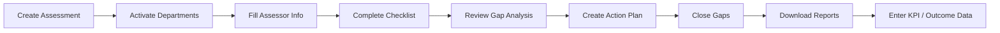
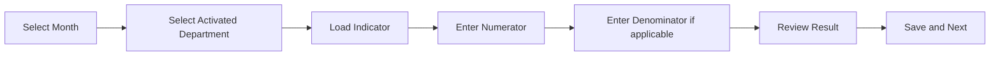

# SaQshi User Guide

Version: 1.0  
Updated: 2026-07-15  
License: GPL-3.0

## Purpose

This guide explains how a normal SaQshi user works in the application. It is
written for facility users, block users, district users, division users and
state users.

Use this guide when you want to know:

- where to go,
- what each page is used for,
- what action you should perform,
- what common messages mean,
- what to do if something does not load.

## Login

Open the application:

```text
{main_url}/ui/login.html
```

On the login page:

1. Enter user name.
2. Enter password.
3. Complete captcha.
4. Click login.

If login is successful, SaQshi opens the dashboard according to your role.

If login fails:

- Check user name.
- Check password.
- Refresh captcha and try again.
- If the message says something went wrong, contact the technical person and share the time of error.

## Main User Types

| User Type | What They Can Usually See |
|---|---|
| Facility User | Facility dashboard, assessment, CQI, performance, reports, profile and facility profile. |
| Block User | Monitoring data for assigned block. |
| District User | Monitoring data for assigned district. |
| Division User | Monitoring data for assigned division/region. |
| State User | State-level monitoring, certification, reports, users and drill-down views. |

Menus are role-based. A state user should not see facility assessment-entry
menus. A facility user should not see full state administration menus.

## Facility User Workflow

Facility users normally follow this flow:



## Dashboard

The dashboard gives a quick view of:

- active assessment,
- assessment progress,
- baseline score,
- final score/progress,
- open gaps,
- department/checkpoint completion,
- KPI/outcome month-wise entry status.

Use dashboard buttons for quick navigation:

- **New Assessment**: go to create assessment.
- **Assessment List**: view previous/current assessments.
- **Reports**: open report dashboard.
- **Continue Assessment**: open checklist for active assessment.

## Create Assessment

Page:

```text
Assessment > Create Assessment
```

Use this page to start a new assessment.

Important rule:

- You can create a new assessment only if no active assessment exists.
- If an active assessment exists, complete or cancel it before creating another one.

Typical fields:

- Assessment name
- Framework
- Start date
- End date
- Remarks

If the page says active assessment already exists, use the current assessment or cancel it if your process allows.

## Assessment List

Page:

```text
Assessment > Assessment List
```

Use this page to see:

- all assessments for the facility,
- status: active, completed, cancelled or in progress,
- score,
- continue button.

Continue should take you to the checklist page.

## Activate Departments

Page:

```text
Assessment > Departments
```

Use this page after creating an assessment.

You will see departments applicable to the facility/framework. Activate only
the departments that are applicable.

Rules:

- Activated department shows as activated.
- Button may be locked/disabled after activation for current assessment.
- Only activated departments appear in assessor info, checklist and performance flows.

## Assessor Information

Page:

```text
Assessment > Assessor Info
```

Use this page after department activation.

For each activated department, fill:

- assessor name,
- assessee name,
- date of assessment,
- assessment type.

If information already exists, SaQshi shows saved details. Use edit/update if correction is needed.

## Checklist Assessment

Page:

```text
Assessment > Checklist
```

Use this page to complete checkpoint responses.

Select:

1. Department
2. Area of concern
3. Subtype/standard
4. Assessment method if applicable

Then checkpoints load one by one.

Response meaning:

| Score | Meaning |
|---:|---|
| `0` | Non-compliance |
| `1` | Partial compliance |
| `2` | Full compliance |

Use:

- **Next** to move to next checkpoint.
- **Back** to go to previous checkpoint.
- **Update/Edit** if checkpoint is already completed and needs correction.

If all checkpoints are completed for an area of concern, SaQshi shows a completion message and gives an edit/update option.

## Gap Analysis

Page:

```text
CQI > Gap Analysis
```

Use this page after checklist entry.

Gap analysis shows checkpoints where score is:

- `0` non-compliance,
- `1` partial compliance.

These are the areas requiring improvement.

## Action Plan

Page:

```text
CQI > Action Plan
```

Use this page to prepare action plans for each gap checkpoint.

SaQshi can show:

- suggested/predefined action plan from checklist JSON,
- earlier user-entered action plans,
- facility name for suggested plan history.

You can:

- copy suggested plan,
- write your own plan,
- choose responsible person,
- choose target date,
- save and next,
- go back,
- update existing plan.

If all checkpoint action plans are completed, SaQshi shows a completion message and gives edit/update option.

## Evidence Upload

Evidence upload is optional unless your process marks it required.

Allowed evidence can include:

- image,
- PDF,
- Word document,
- Excel file,
- camera image.

If wrong file is uploaded, use delete option and upload the correct file.

## Gap Closure

Page:

```text
CQI > Gap Closure
```

Use this page when action is completed.

For each action plan:

- add closure remarks,
- add revised score if applicable,
- attach evidence if available,
- mark status completed.

Closure updates final score/progress.

## Performance Monitoring

Pages:

```text
Performance > Dashboard
Performance > KPI
Performance > Outcome
Performance > Trend
```

Use performance pages for monthly KPI/outcome data entry.

General flow:



Notes:

- Date/month should be selected from calendar/month control.
- If denominator is `N/A`, denominator field may be read-only.
- When all indicators for a month are completed, SaQshi shows a completion message.
- Trend page shows month-wise data and charts.

## Reports

Pages:

```text
Reports > Report Dashboard
Reports > Score
Reports > Progress
State Reports
```

Reports may include:

- checkpoint scorecard,
- progress report,
- action plan and gap closure report,
- performance report,
- facility list,
- assessment details,
- CQI details,
- certification details,
- state monitoring reports.

For file downloads:

1. Click download/report button.
2. Wait for file.
3. Open in Excel/PDF viewer.
4. Check facility name, assessment name, score and status.

## Facility Profile

Page:

```text
Administration > Facility Profile
```

Facility user can view facility details.

If allowed, user can update:

- facility name,
- NIN number,
- facility type,
- address/admin details,
- geo coordinates.

Geo coordinates can use current location. NIN number should not duplicate another facility.

## My Profile

Page:

```text
Administration > My Profile
```

Use this page to update user profile details such as:

- name,
- mobile number,
- email,
- password.

Password should normally contain:

- minimum 8 characters,
- one uppercase letter,
- one lowercase letter,
- one digit,
- one special character.

## State Monitoring

State, division, district and block users see monitoring pages based on their role.

Common pages:

- State Dashboard
- Certification Map
- Facility Categorisation
- Certification Status
- Assessment Progress
- CQI Monitoring
- Performance Monitoring
- Facility Drill-down
- User Administration
- State Reports

Data is automatically limited by login role:

| Role | Scope |
|---|---|
| State | All configured state data |
| Division | Assigned division |
| District | Assigned district |
| Block | Assigned block |

## Certification Status

Use certification status to:

- view all facility certification status,
- add/update certification,
- check certification date,
- check expiry,
- check score,
- download report.

Certification map plots certified facilities using geo coordinates.

## Facility Drill-down

Facility drill-down lets monitoring users move through:

```text
State -> Division -> District -> Block -> Facility
```

Click plus icon to expand each level.

When a facility is opened, it can show:

- assessment count,
- completed/in-progress/cancelled status,
- KPI/outcome status,
- open gaps,
- CQI status,
- certification status.

## User Administration

For monitoring/admin users, user administration can:

- search users,
- view user details,
- activate user,
- deactivate user.

## Documentation and Help

Open:

```text
{main_url}/gitbook.html
```

Use documentation to read:

- user guide,
- developer guide,
- API docs,
- Postman testing guide,
- Swagger/OpenAPI,
- service map,
- configuration formats,
- security/testing/compliance docs.

## Common Messages and What They Mean

| Message | Meaning | What to Do |
|---|---|---|
| `Validation failed` | Required field missing or wrong | Check form fields and try again. |
| `Facility ID is required` | Facility context not loaded | Refresh, login again, or contact technical support. |
| `No active assessment` | No active assessment found for facility | Create or select an active assessment. |
| `Active assessment already exists` | New assessment cannot be created yet | Continue, complete, or cancel current assessment. |
| `CSRF token missing/invalid` | Security token expired/missing | Refresh page or login again. |
| `Unauthorized` | Session expired or role not allowed | Login again or check user role. |
| `Something went wrong` | Internal error hidden for safety | Try again; if repeated, share time/page with technical team. |
| `NetworkError` | API not reachable or wrong host/port | Check server URL and internet/local network. |
| `No data found` | No matching records yet | Complete related workflow first or change filter. |

## Good Working Practice

- Start from dashboard.
- Complete one workflow step at a time.
- Use refresh only after saving data.
- Do not open multiple checklist tabs for same assessment.
- Check active assessment before entering checklist/performance data.
- Download reports after completing major steps.
- Report exact page name and time when asking for technical help.

## Quick Navigation

| Need | Go To |
|---|---|
| Start new assessment | Assessment > Create Assessment |
| Activate departments | Assessment > Departments |
| Fill assessor details | Assessment > Assessor Info |
| Enter checklist score | Assessment > Checklist |
| See gaps | CQI > Gap Analysis |
| Plan improvement | CQI > Action Plan |
| Close gaps | CQI > Gap Closure |
| Enter monthly indicators | Performance > KPI / Outcome |
| View trend | Performance > Trend |
| Download scorecard | Reports > Score |
| Download progress | Reports > Progress |
| Update profile | Administration > My Profile |
| Update facility | Administration > Facility Profile |
| Read help | GitBook Documentation |
